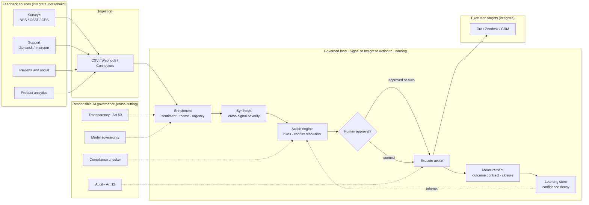
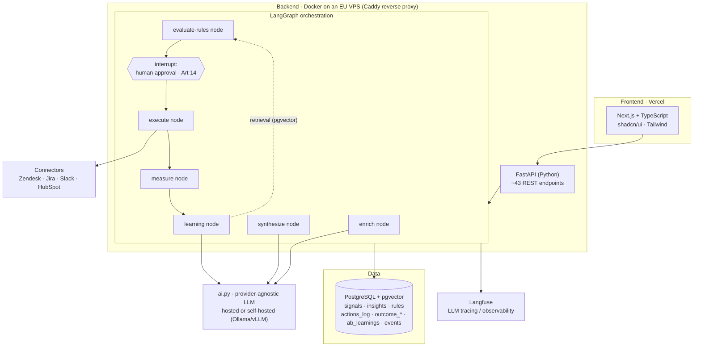
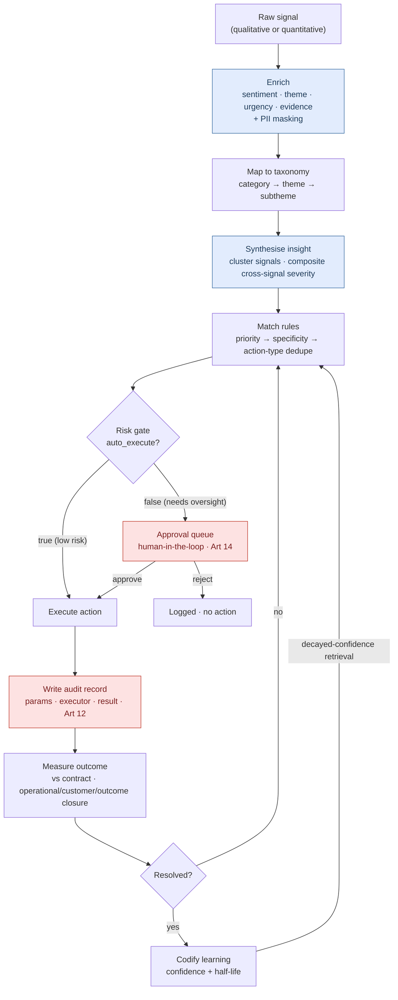
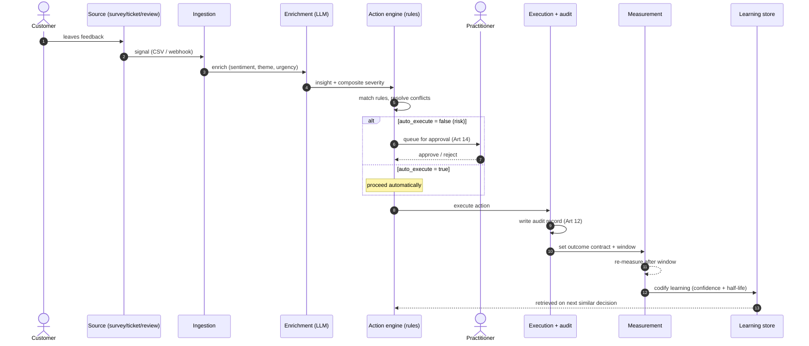
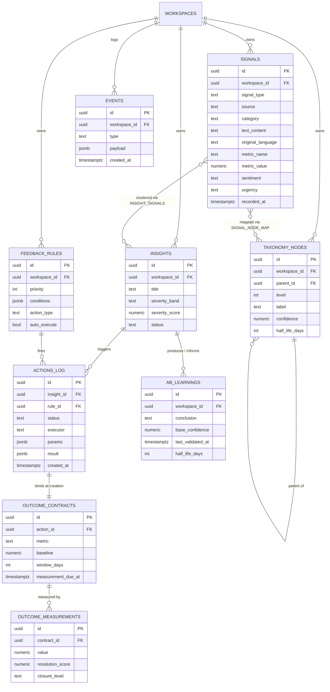
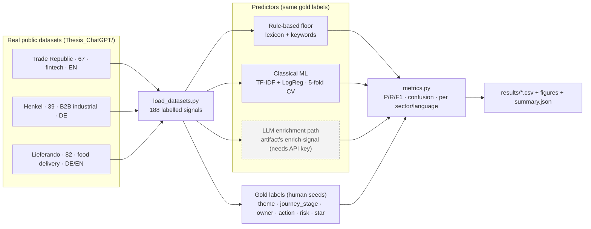
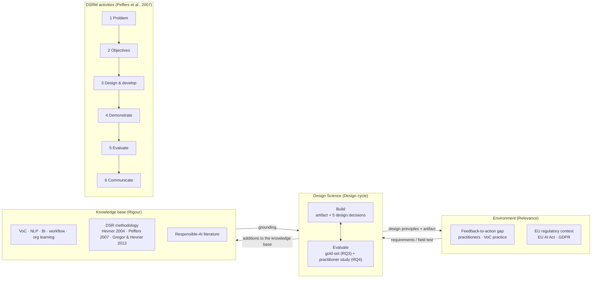

# Thesis Diagrams

All diagrams are **Mermaid** (plain text, edit anywhere). This file renders in Obsidian and GitHub. Each block is also a standalone `.mmd` file; PNG/SVG renders live in `rendered/`. The data model also ships as runnable Postgres DDL in `schema.sql`.

## Figure A — Logical system architecture (build-agnostic)

*source: `01_architecture_logical.mmd`*

## Figure B — (retired) Odradek prototype architecture

*The earlier React/Vite + Supabase implementation was superseded in July 2026 when the manuscript settled on CLARA. Its diagram source and renders are archived in `../archive/odradek/`.*

## Figure C — Implementation: CLARA (Next.js + FastAPI + LangGraph)

*source: `03_architecture_clara.mmd`*

## Figure D — Data pipeline: Signal → Insight → Action → Learning

*source: `04_pipeline_flow.mmd`*

## Figure E — Signal lifecycle with human-in-the-loop approval

*source: `05_sequence_hitl.mmd`*

## Figure F — Data model (ER); runnable DDL in schema.sql

*source: `06_data_model_er.mmd`*

## Figure G — Real-data gold-set evaluation harness (Ch 5 §5A)

*source: `07_evaluation_pipeline.mmd`*

## Figure H — Design Science Research method (Hevner cycles + DSRM)

*source: `08_dsr_method.mmd`*

