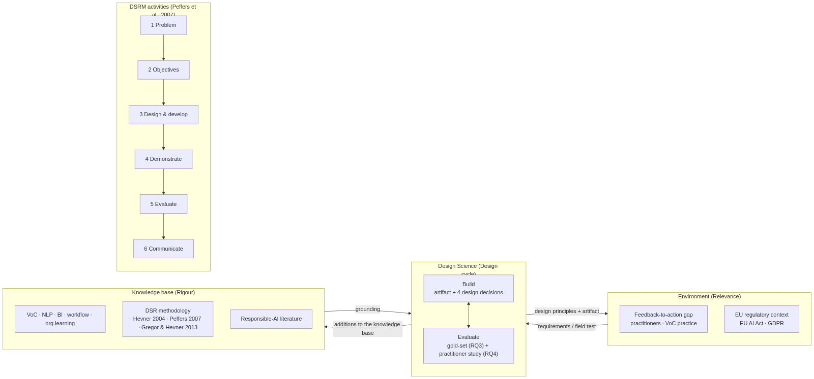

# Chapter 3: Methodology

## 3.1 Research Paradigm: Design Science Research

This thesis adopts **Design Science Research** (DSR), the information-systems research paradigm whose unit of analysis is a purposeful *artifact* built to address a relevant organisational problem, and whose contribution is judged by the artifact's utility and by the design knowledge it yields (Hevner, March, Park, & Ram, 2004). DSR is the appropriate paradigm here because the research aim, to operationalise the feedback-to-action loop, is inherently constructive. The central question is not "what is?" but "what works, and why?". The problem (the feedback-to-action gap) is well documented in the behavioural literature (Bone et al., 2017). The open question is *how to design* a system that closes it under governance, and that is a design problem.

The work is organised around Hevner's (2007) **three-cycle view**. The *relevance cycle* connects the artifact to its environment: the practitioner problem (Chapter 1), the requirements distilled from VoC practice and the EU regulatory context, and the field evaluation through practitioner interviews. The *rigour cycle* grounds the design in the knowledge base: the literature of Chapter 2 and the DSR and Responsible-AI methodological foundations. The *design cycle* iterates build-and-evaluate internally, refining the artifact across versions until it is fit for evaluation.

The research activities follow Peffers, Tuunanen, Rothenberger, and Chatterjee's (2007) **Design Science Research Methodology** (DSRM), a problem-centred entry point with six activities, mapped to this thesis as follows:

| DSRM activity | Instantiation in this thesis |
|---|---|
| 1. Problem identification and motivation | The feedback-to-action gap (Ch 1, Ch 2): collection without operationalisation, unmeasured closure, lost memory. |
| 2. Objectives of a solution | A governed Signal → Insight → Action → Learning loop; measured closure; perishable, retrievable organisational memory; EU AI Act / GDPR-aligned oversight (Ch 1, §1.3; Ch 4). |
| 3. Design and development | The artifact and its five non-trivial design decisions (Ch 4). |
| 4. Demonstration | The artifact run end-to-end on real customer feedback; the gold-set pipeline run (Ch 5, §5A). |
| 5. Evaluation | Quantitative accuracy against reference labels (§5A) and a qualitative practitioner study with SUS/TAM (§5B). |
| 6. Communication | This thesis and the defence. |

Following Gregor and Hevner (2013), the intended contribution sits at the level of an *improvement* (a better solution to a known problem) and yields both an instantiation (the platform) and nascent design theory (the design principles synthesised in Chapter 6). The artifact was developed as a *search process* (Hevner et al., 2004, Guideline 6): several scope boundaries are themselves findings about what a loop-closure system does and does not need (Ch 4, §4.6).

## 3.2 Research Questions and the Working Hypotheses

The four research questions (Chapter 1, §1.3) are the claims this thesis answers, and Chapter 1 (§1.7) states what kind of evidence stands behind each. Eight working hypotheses formulated at proposal stage (H1–H8: the insight-action gap, signal fragmentation, signal-type reliability, journey-stage prioritisation, owner routing, approval and trust, auditability and trust, closure practised and valued) are subsumed by the questions; they survive as coding labels in the interview guide and survey (Appendix A) and as rows of the traceability matrix (Appendix D), where each is marked measured, demonstrated, exploratory or pending against the evidence. Consistent with the methodological stance below, they are design propositions assessed for plausibility and utility, not statistical effects tested for significance.

**RQ3b is not derived from the working hypotheses.** None of them anticipates a language-equity effect. The equity question arose *from* the evaluation, specifically from the observation that the rule-based floor escalated none of the eight German-source signals whose reference label warranted escalation (§5A.5), and it is answered directly by that evidence rather than through a prior hypothesis. I report it this way because it is a legitimate design-science outcome rather than an omission: the build-evaluate cycle is expected to surface questions the design cycle did not pose (Hevner, 2007), and reporting the question as emergent is more honest than retrofitting a hypothesis to a result already in hand.

## 3.3 Research Design Overview: Mixed Methods

The artifact is evaluated through a **convergent mixed-methods** design that triangulates two independent evidence streams:

- a **quantitative** gold-set evaluation that measures how well the artifact's AI enrichment reproduces the reference sentiment and risk/severity labels on real feedback (§3.7), and whether escalation differs by language (RQ3a, RQ3b); and
- a **qualitative** practitioner study, consisting of semi-structured interviews and task-based prototype sessions, that captures perceived usefulness, usability, and trust (RQ4), supplemented by the standardised SUS and TAM instruments.

The evidence the two streams have produced is not symmetrical, and the design is reported as it stands rather than as it was planned. The quantitative stream is complete and carries the thesis's **measured** claims (RQ3a, RQ3b). The design claims (RQ1, RQ2) rest on **demonstration**: the artifact built, running in production and regression-tested, together with the design walkthrough of Appendix B. The qualitative stream is **exploratory**: it was planned as the primary validation of the design with practitioners, no session had been run at the time of writing, and §5B states in advance what is reported at whatever sample the study reaches and how it is labelled. Neither stream alone is sufficient: accuracy without practitioner trust does not close the gap, and practitioner enthusiasm without demonstrated accuracy is not credible. What can be claimed is therefore ordered: measured triage quality first, a demonstrated and instrumented loop second, practitioner perception third.

## 3.4 Artifact Development Method

The artifact was built in iterative build-evaluate cycles. Deterministic responsibilities (schema validation, rule conflict resolution, audit logging, action execution, outcome scoring) were implemented in code. Bounded language-model reasoning (enrichment, synthesis, learning extraction) was confined behind a single provider-agnostic interface, so that model behaviour is isolated, swappable, and testable. Ahead of evaluation the platform was placed under a **feature freeze**: only fixes required by the evaluation (bug fixes, demonstration data, task-metric instrumentation) were permitted, to hold the artifact stable across participants. The platform records an `events` telemetry stream (rule creation, approvals, status advances carrying time-to-action, measurement, learning retrieval), which feeds the task-metric analysis in §5B.

## 3.5 Quantitative Evaluation Design (RQ3a, RQ3b)

### 3.5.1 Gold-set construction

The quantitative evaluation treats the artifact's enrichment and routing pipeline as a multi-field classifier and measures agreement with **reference labels** ("seeds") attached to a corpus of real customer feedback; §3.7 states their provenance, an independent star rating for sentiment and assistant-drafted seed labels for the other fields. The corpus is drawn from three publicly-sourced, paraphrased, de-identified datasets (described in §3.7), each shipping a *detailed research table* with the following gold fields per signal: `theme_seed`, `journey_stage_seed`, `recommended_owner_seed`, `recommended_action_seed`, and `risk_seed`, together with `star_rating_1_5`, `language`, and `source`.

A second, complementary reference set lives *inside* the artifact: the curated **golden set** driving the in-repo live evaluation harness, whose results are reported as convergent evidence in Chapter 5 (§5A.7). Initially 60 English cases, it was grown in July 2026 to **80 bilingual items** through 20 German additions (ids `eval-061`–`080`), authored to supply registers absent from the English cases (formal *Sie* and informal *du* address, irony, compound nouns) under the set's documented labelling rules. Authored items risk encoding my own labelling bias, so the new stratum passed an explicit **adversarial verification protocol**: two independent skeptic agents re-examined every label against the rules, confirming 19 of 20 and raising exactly one dispute, which was reconciled and accepted (`eval-078`, urgency low → medium). The 20 items follow a **14 optimisation / 6 held-out** split, and a per-item language field records the set's composition. The set was extended again later in July 2026 to **100 items (72 en / 28 de)**, with the German stratum completed to the same two-tag rubric the English items follow. That completion is disclosed as improving German tag metrics partly *by construction*, since several added tags name themes the model was already predicting correctly against under-labelled gold. One provenance fact is disclosed wherever these items' numbers are reported, in the artifact's model card and throughout this thesis: **the German stratum is authored, not naturally occurring**. The three public datasets' texts turned out to be English paraphrases, and no natural German customer texts were locally available. The German figures therefore characterise performance on constructed, adversarially-verified German, not on field German.

### 3.5.2 Metrics

The five predicted fields differ in cardinality, and the cardinality dictates the metric:

- **Categorical fields.** Journey stage, recommended owner, and risk/severity have small, closed label sets. These are scored with **precision, recall, and macro/micro F1**, with per-class **confusion matrices** to expose systematic mis-routing (for example, conflating "billing" with "account management").
- **Open-vocabulary fields.** `theme_seed` (and to a degree `recommended_action_seed`) are free-text and high-cardinality, so exact-match accuracy is an unfairly strict metric. These are evaluated by **semantic agreement**: predicted and gold labels are embedded and compared by cosine similarity against a threshold, complemented by a **clustering-agreement** measure (the degree to which signals the artifact groups under one theme share a gold theme). A small human adjudication of borderline cases calibrates the threshold. This open-vocabulary caveat is reported explicitly so that theme-level numbers are not over-interpreted.
- **Sentiment** is cross-checked against the `star_rating_1_5` signal where present (low ratings should not be classified as positive sentiment). This gives an independent, non-circular validity check.

One metric is deliberately scope-limited as a **measurement-validity decision**: the in-repo harness's hallucination heuristic token-grounds predicted tags against the *English* tag vocabulary, so applied to German text it would falsely flag correct tags as hallucinated. The metric therefore simply **omits** non-English items. A narrower valid measure is preferable to a broader invalid one, and the artifact's model card discloses the restriction.

### 3.5.3 Breakdowns and baselines

Results are reported **per sector** (fintech, B2B industrial, food delivery) and **per language stratum** (English-source, German-source; the `language` field records the source review's language, while the paraphrased texts are English, §3.7) to assess generalisation across origins. This is a direct test of H3 and a probe of the fairness concern that feedback in some languages or channels may be triaged less reliably (Mehrabi et al., 2021). Per-language results are always reported **stratified, with their denominators** (on the golden set: EN n = 72, DE n = 28, pooling the optimisation and held-out halves; the held-out half is reported separately) rather than as a blended average, so a small stratum can neither be hidden inside a headline figure nor over-read as a precise estimate. The artifact commits the same discipline in production: an explicit `--publish` flag writes a committed metrics snapshot (`published_metrics.json`, carrying the sample size, each language's accuracy with its denominator, confidence intervals, dataset date, and provenance notes), which the API serves (`GET /model-card/metrics`) and the product's model card renders. The numbers users see are the numbers the harness wrote. Where feasible, the LLM pipeline is compared against a **simple baseline** (a bilingual lexicon classifier for sentiment, a keyword classifier for risk, and majority-class floors for journey stage and owner; §5A.2), so that the value added by the language model is quantified rather than assumed. The three predictors are also compared pairwise with an exact McNemar test on identical items (the same convention as the in-repo harness), so each step of the floor → learned → contextual ordering carries its own significance test rather than an eyeballed gap (§5A.3–5A.4). The evaluation is implemented as a reproducible harness (`evaluation/`) that writes all metrics and figures from data. No number in §5A is hand-entered.

For the effect of the few-shot exemplar store (Chapter 4), the designed inference is an **in-run paired A/B**: within a single evaluation run, every item is scored with exemplars off and with exemplars on, and the paired difference is tested with **McNemar's test** on the discordant items. This choice is forced by an observed property of the model: it is **non-deterministic even at temperature 0**, so *cross-run* comparisons confound any intervention with model noise. Cross-run deltas are reported only with that caveat attached, never as the basis of a significance claim. The resulting tests are reported in §5A.7 at every sample size, including the stages where they were underpowered and therefore not claimed. The urgency comparison, withheld at n = 80 (p = 0.219) and claimed only at n = 100 (p = 0.039), is the worked example.

One caveat is owed on this trajectory. Testing the same hypothesis at successive sample sizes (n = 60, 80, 100) and claiming at the first crossing is **sequential testing without alpha spending**, and it formally inflates the type-I error of any single p-value read in isolation. Two mitigations apply. First, the claim as made does not rest on one crossing: the effect was significant in three same-day re-runs of the identical 100 items, which bounds model noise but is not replication over items, so the claim is held as exploratory. The golden set's held-out split (n = 30) does not yet supply a confirmatory read of the exemplar effect. What has been reported for it (§5A.7) is the held-out *accuracy* of the exemplars-on configuration, not a paired exemplars-off-versus-on difference on the held-out items; and the split is a frozen validation split rather than an untouched final test, because it has been scored on every published run since the set was first committed: the split entered the repository with the set on 17 July 2026 at n = 80 (held-out 18 EN / 6 DE), took its current membership (23 EN / 7 DE) on 18 July 2026 when the set grew to 100, and was scored in the five published runs since (two on 17 July on the 80-item split, two on 18 July and one on 6 September on the 100-item split; the number of unpublished runs is not recoverable, since the run ledger and reports are not versioned), its per-item failures were printed to the operator each time, and the enrichment pipeline changed after the split was frozen (8 August, 2 September and 5 September 2026). The per-split paired effect is computed by the updated harness from its next run onward and was not available at the time of writing. Second, the golden set's growth was driven by coverage interventions (adding the German stratum, completing the tag rubric), not by peeking at the test statistic. Nonetheless, for future confirmatory claims the sample size is frozen in advance of the run that carries the claim, and the eval loop's local ledger and commit history record attempted as well as accepted iterations, so the number of comparisons behind any accepted change remains traceable.

### 3.5.4 Threats to validity

The reference labels were drafted by a language-model research assistant alongside the datasets and used as delivered (§3.7), so they are a *documented* but not an *oracle* ground truth, and for the risk field the blind double-labelling of §3.7 is the only human check on them, a second person's rating on the owner's attestation, whose provenance record (`evaluation/results/PROVENANCE_kappa.md`) does not capture whether the rater saw any AI-generated suggestion. Inter-annotator disagreement on open themes is acknowledged. Looking past this thesis's window, the outcome contracts themselves (Chapter 4) will require **quasi-experimental** evaluation once run on live data. Randomisation is infeasible in single-organisation pilots, so interrupted time series (segmented regression at the action date) is the minimum credible design, with synthetic difference-in-differences (Arkhangelsky et al., 2021) as the stronger panel-data option. The platform's shipped measurement design implements exactly this (§3.5.5), and naive before/after deltas are explicitly not sufficient (Chapter 6, §6.5). Two further properties of the corpus bound what the per-language results can mean. The `language` field records the language of the source review, while the paraphrased texts are English, so per-language slices are source-language strata rather than text-language strata, and they say nothing about German-text processing (the authored golden set carries that evidence, §5A.7). And because every text passed through paraphrasing, part of the lexicon floor's failure may reflect the paraphrase style rather than customer language in the wild; the finding is therefore claimed for paraphrased operational phrasing, which is how §5A.3 words it. The corpus is modest in size (≈190 labelled qualitative signals) and was assembled to be balanced rather than statistically representative of any population, so accuracy figures characterise the pipeline on this corpus, not a population estimate. Using a language model both to *predict* and (for theme similarity) to *judge* risks a degree of circularity. This is mitigated by the independent star-rating cross-check and by human adjudication of borderline theme matches.

### 3.5.5 Quasi-experimental outcome scoring: interrupted time series

Whether a remediation action *worked* cannot, in a production feedback system, be established by a randomised experiment. The action is applied to every affected customer at once, and withholding a fix from a control group is neither ethical nor commercially acceptable. Naïve before/after deltas, however, are weak evidence: they confound the intervention with trends and seasonality, and field evidence shows that well-intentioned recovery actions can have null or even negative effects (Halperin et al., 2022), which is why measurement must be default-on rather than opt-in. The platform therefore scores outcomes with an **interrupted time series (ITS) design using segmented regression** (Wagner, Soumerai, Zhang, & Ross-Degnan, 2002; Bernal, Cummins, & Gasparrini, 2017), the standard quasi-experimental design when an intervention has a known onset date and no concurrent control is available.

**Model.** For a problem theme with journey/stage-scoped daily signal counts $y_t$ (signals per complete UTC day), with the intervention at day $t_0$. What $t_0$ is read from is recorded on the measurement plan as its *origin*: the dispatch instant of a successful push (the moment the approved action left the system); the human-recorded implementation instant, when someone attests that the fix landed, which supersedes the pending checkpoints and restarts the clock from that moment; or the approval instant only when the draft itself is the deliverable because no connector is configured for the destination, a case the readout labels as running from approval. A failed push starts no clock, because nothing reached the world that inflow could react to. The model is

$$y_t = \beta_0 + \beta_1 t + \beta_2\,\text{post}_t + \beta_3\,(t - t_0)\,\text{post}_t + \varepsilon_t$$

where $\text{post}_t = \mathbb{1}[t \ge t_0]$. $\beta_2$ estimates the immediate **level change**, $\beta_3$ the **slope change**. The reported effect is the model-implied difference at the end of the observation window between the fitted post-intervention trend and the pre-intervention counterfactual, $\hat\Delta = \beta_2 + h\beta_3$ with $h$ the horizon in days, with a 95% confidence interval from $\widehat{\text{Var}}(\beta_2 + h\beta_3) = \sigma^2\!\left[(X'X)^{-1}_{22} + h^2 (X'X)^{-1}_{33} + 2h (X'X)^{-1}_{23}\right]$ and Student-$t$ critical values at $n-4$ degrees of freedom. The estimator is closed-form OLS (normal equations, Gauss–Jordan with partial pivoting), implemented dependency-free in ~60 lines.

**Series construction (bias controls).** Three deliberate rules, each of which measurably biased the estimate when omitted:

1. **Complete UTC days only.** The bucket for the read-time day is a partial observation. Entering it at full-day scale drags the endpoint of the fit: Monte-Carlo simulation on a no-effect series (Poisson(10) noise) showed a spurious negative point effect in ~66% of mid-day reads and false CI exclusion of zero in 5–7.5% of reads versus the nominal 2.5%.
2. **The day of $t_0$ is excluded** from the fit. It mixes pre- and post-intervention exposure, and assigning it to the post segment understates $\beta_2$ and manufactures a spurious $\beta_3$.
3. **No fabricated history.** The pre-window (up to 28 days before execution) is truncated at the first observed signal. Days before data existed are not counted as zeros.

**Honesty rules.** With fewer than 10 pre-intervention or 5 post-intervention daily buckets, the system refuses to fit and reports a labelled plain difference of means ("insufficient data for ITS") with **no confidence interval**. An underpowered regression dressed up with a CI would be less honest than a labelled delta. Simulated data is structurally quarantined: outcome series derive exclusively from raw ingested signals, and the simulation harness cannot write measurements.

**Outcome contracts.** The measurement is contracted *before* acting. At approval time the system proposes a contract that is applied by default, editable, and declinable: baseline = the trailing signal rate over the observed span (capped at 28 days; dividing by a fixed window would dilute young workspaces' baselines by up to 4×), a 30-day measurement window with a T+7 early read, and a success threshold of a 50% rate reduction. Contracts are versioned: the proposal at approval and every later amendment (recorded with its author, time, note and field diff) create a new revision, the primary metric cannot be changed once an observation has been recorded against it, each checkpoint is scheduled under a named revision, and every reading freezes the contract it was scored under, so a reading already on record keeps the status it earned under the revision in force when it was taken and an amendment never re-labels it; the next scheduled read evaluates the new terms. The checkpoints run from the plan's origin ($t_0$ above), and scheduled re-measurement over due checkpoints runs via pg_cron (or an in-process fallback loop).

**Grading and bounding the measurement itself.** Three further design elements, added in the July 2026 design cycle, make the *quality* of each measurement legible rather than leaving all readouts to carry equal apparent weight. First, every outcome readout is stamped with an **evidence grade (A–E)** that grades the measurement *design*, not the result: **A** randomised holdout; **B** controlled quasi-experiment (a grade reserved in the taxonomy but not yet produced by the platform); **C** interrupted time series; **D** uncontrolled before/after; **E** manual assertion or unmeasured. The grade is computed from the comparison method together with the **measurement provenance**. Every measurement is either *instrumented* (scheduler-computed from signals) or *manual*; manual values are labelled "unverified manual observation" in the UI, and the API route force-stamps manual provenance so it cannot be spoofed by clients. On the outcome board the grade follows the contracted design; on the problem detail, which runs the fit, it follows the fit actually obtained, so an ITS contract whose series was too sparse to fit reads D, a labelled before/after delta, and never C. A naive delta therefore cannot masquerade as quasi-experimental evidence on the readout where the estimate is shown. Second, declared **guardrail metrics** are actually measured at every checkpoint rather than merely declared. The repeat-signal guardrail (the daily rate of post-execution theme signals from customers already observed in the 28-day pre-window, omitting identity-less signals since they cannot evidence a repeat complainer) is checked for **non-inferiority** against that pre-window baseline. A breach (a relative worsening of more than 20%) informs but never blocks, and a guardrail without a data source surfaces an explicit "no data source" marker instead of silence. Third, at contract proposal time a **detectability note** applies a two-sample Poisson normal-approximation **minimum-detectable-effect heuristic at 80% power**, flagging measurement windows too small to detect the contracted effect *before* approval. It is explicitly labelled a heuristic, not a formal power analysis (Cohen, 1988), and it is a *lower* bound: the two-sample bound ignores the variance the segmented-regression estimator adds through the slope term (h²·Var(β₃)). For the default contract (28 pre-days, 30 post-days, a 50% reduction) the estimator's own variance factor is about seventeen times the two-sample one, which puts the break-even baseline near 37.6 signals per day for one theme and stage, against 2.2 under the two-sample bound. Below that rate the contract is a directional read, and the note should be read as saying so.

The estimator's known caveats (approximate OLS confidence intervals pending heteroskedasticity-and-autocorrelation-consistent errors, OLS on rates rather than a count GLM, and earliest-execution attribution when actions on one theme overlap) are carried into the limitations (§6.4). The design-to-code mapping is given in Appendix D.

## 3.6 Qualitative Evaluation Design (RQ4)

### 3.6.1 Participants and sampling

The target population is marketing, product, and customer-experience practitioners with **2+ years' experience at companies of roughly 10–500 staff that actively collect customer feedback**, the artifact's intended users. Purposive sampling seeks variation across the three roles and across company size. The recruitment target is **12–15 completed interviews**, over-booked to ~18 to absorb no-shows, recruited via LinkedIn, practitioner communities, and referral chaining (each interviewee is asked for one or two introductions). Recruitment materials are reproduced in Appendix A.

### 3.6.2 Procedure

Each session is a 25–30 minute online, semi-structured interview in two parts: (i) the participant's *current* practice, that is, how their organisation acts on feedback today and where it stalls (eliciting evidence on H1, H2, H5, H8); and (ii) a *task-based* encounter with the prototype, in which the participant attempts a small set of realistic tasks (for example, triage a batch of signals, create a governed rule, approve a queued action, inspect a closed-loop measurement). With consent, sessions are audio-recorded and transcribed automatically; recordings are deleted after transcription. Task completion and time-to-action are captured both by facilitator observation and by the platform's `events` telemetry.

### 3.6.3 Instruments

After the task portion, participants complete the **System Usability Scale** (Brooke's ten-item SUS) and a short **Technology Acceptance Model** battery measuring perceived usefulness and perceived ease of use (Davis, 1989), plus targeted trust items addressing auditability and human oversight (H6, H7). The instruments are reproduced in Appendix A.

### 3.6.4 Analysis

Transcripts are analysed by **codebook thematic analysis**, following the six phases Braun and Clarke (2006) set out (familiarisation, coding, theme construction, review, definition and naming, reporting) with a structured codebook (Appendix A). The choice of the codebook variant over the reflexive one is deliberate, and it is stated because the two carry different quality criteria. Braun and Clarke (2019, 2021a, 2021b) distinguish coding-reliability and codebook approaches, in which a codebook is fixed early by consensus, coding is structured around it and agreement between coders is a meaningful quality check, from *reflexive* thematic analysis, in which themes are constructed late from the researcher's engagement with the data and neither a consensus codebook nor an inter-coder agreement statistic belongs to the method. This study's analysis starts from twelve deductive codes derived from the working hypotheses H1–H8, adds inductive codes as they arise, fixes the codebook by consensus before the full coding pass, and checks a double-coded subset for agreement, so it is a codebook analysis and is labelled as one; no reflexive-specific validity claim is made. The second coder is a role to be filled, not a named person: a practitioner or researcher who took no part in the interviews, briefed on the codebook only. The agreement statistic is Cohen's κ on code presence per transcript segment, computed over a double-coded subset of at least one quarter of the transcripts (all of them below eight); κ below 0.60 is the threshold at which the codebook is revised and the subset re-coded before coding proceeds. Every disagreement is reconciled by discussion between the two coders, the reconciled code is recorded, and the codebook definition is amended wherever the disagreement exposed an ambiguity. Themes are then mapped to the research questions, with the hypothesis codes of Appendix D as coding labels. SUS is scored conventionally (0–100) and reported as a mean with a t-based 95% confidence interval (at n = 12–15 roughly ±9 to ±13 points) against the published anchors (about 68 is the empirical average; Bangor, Kortum, and Miller's (2009) adjective scale puts "good" near 71.4 and "excellent" near 85.5; Sauro and Lewis's (2016) grade A begins near 80.3); TAM items are summarised descriptively, with the author-written trust and friction items reported as such (Appendix A). Given the sample size, all quantitative summaries of the qualitative data are reported as descriptive, not inferential.

## 3.7 Datasets

The evaluation uses **only real, publicly-sourced** customer-feedback datasets. Synthetic datasets available in the project were deliberately excluded, so that accuracy claims rest on genuine customer language. Three datasets are used, chosen for sector and language diversity:

| Dataset | Sector | Qual. signals | Dominant source language | Gold labels |
|---|---|---|---|---|
| Trade Republic | Fintech / digital brokerage | 67 | EN | theme, journey stage, owner, action, risk |
| Henkel (adhesives) | B2B industrial / consumer goods | 39 | DE | theme, journey stage, owner, action, risk |
| Lieferando | Food delivery | 82 | DE / EN | theme, journey stage, owner, action, company-response pattern (no risk label) |
| **Total** | | **188** | EN 102 · DE 84 · other 2 | |

Each dataset was assembled from public review and discussion sources (Trustpilot, Google Play, the Apple App Store, Amazon, Reddit). The text is **paraphrased rather than verbatim** and **de-identified** (names, usernames, order numbers, and direct personal details removed), with source URLs and collection dates retained for provenance. One consequence is worth stating explicitly: the paraphrased texts are **English throughout**, and the `language` field records the language of the **source review**, so the corpus is multilingual in origin but not in text. Per-language results in §5A are therefore source-language strata; the golden set's authored German items are the only German-language texts in the evaluation (§3.5.1). Each signal carries seed labels and, where available, a 1–5 star rating; the Lieferando set carries a company-response-pattern label instead of a risk label, so every risk figure in §5A rests on the 106 Trade Republic and Henkel signals. The provenance of the paraphrases and the seed labels is stated here because it bounds what the labels can certify: the three datasets, including the collection of the public pages, the paraphrases, the de-identification and the seed labels, were produced in a ChatGPT research session on 21 June 2026 and used as delivered, without editing; the same process later produced three additional datasets the harness can load but the thesis does not use, whose loader notes describe their seed labels as assistant-drafted and pending review. The seed labels are therefore the judgements of a language-model assistant, not of a human annotator, and the datasets' own READMEs describe them as included for testing and not to be treated as validated gold-standard annotations. Two consequences follow. Sentiment is scored against the star rating, which the customers themselves assigned, and that is the only human-origin reference in §5A. For risk, journey stage and owner, the seed labels are a documented reference rather than an oracle, and the blind double-labelling of a 40-signal risk sample (drawn on 6 September 2026 with the seed labels withheld; `evaluation/kappa_sample.py`) is the one human check on them. Returned the same day, it gives Cohen's κ = 0.55 unweighted (percentile-bootstrap 95% interval 0.38–0.72) and 0.70 linear-weighted (0.56–0.82), exact agreement on 27 of the 40 items and agreement on the binary escalate-or-not decision on 38 of 40 (`evaluation/results/kappa_risk.json`; the rubric the rater worked from, `kappa_labelling_instructions.md`, was written before labelling). That is moderate agreement on the exact level and substantial agreement on the ordering, and the disagreement has a shape: the rater placed seven of the ten seed-*critical* items one level down at *high* and three of the nine seed-*medium* items at *low*, and 38 of the 40 items lie within one level of the seed. The seed labels' ordering holds up; their calibration of the top and bottom thresholds does not, which is the direction of the production stage's shift in §5A.4.2 and bounds how much of that shift can be charged to the artifact. The rater was a second person, not the author, working from the written rubric with the seed labels withheld. The rating's provenance record is `evaluation/results/PROVENANCE_kappa.md`: the second-person statement is the owner's attestation of 12 September 2026, the committed files record neither the rater's identity nor the return time, and whether the rater had access to any AI-generated suggestion for these rows was not recorded, so the rating is treated as a blind human rating on the owner's attestation and no more. The star rating is independent of both the text and the labels, which is why sentiment is scored against it. The seed labels were produced **without reference to the artifact**, so they function as an external reference rather than a self-graded test, but they are unreviewed assistant judgements, not an oracle, and because the drafting was by a language model the risk, journey and owner comparisons inherit a same-family bias that §3.5.4 names.

Their limitations are explicit: public pages expose only sampled, paginated subsets; the corpora are intentionally balanced across positive and negative feedback rather than statistically representative; financial and product claims are unverified customer reports; and B2B industrial feedback is sparse in public sources, so the Henkel set leans on consumer-grade product reviews. These constraints bound the external validity of the quantitative results and are carried into the discussion of limitations (Chapter 6).

## 3.8 Evaluation Criteria

Following Prat, Comyn-Wattiau, and Akoka's (2015) taxonomy of IS-artifact evaluation, the artifact is assessed against a small set of criteria appropriate to its goals: **efficacy and accuracy** (does the enrichment/routing reproduce expert labels? §5A); **usefulness and ease of use** (do practitioners find it valuable and usable? §5B, SUS/TAM); **fidelity to the problem** (does it address the documented gap end-to-end? interviews and demonstration); and **Responsible-AI properties**, that is, human oversight, auditability, and regulatory alignment (assessed by design walkthrough against EU AI Act / GDPR requirements, Appendix B, and by participants' trust ratings). This criterion set operationalises the DSR maxim that an artifact is evaluated by its utility in context, not by novelty alone.

## 3.9 Research Ethics

The qualitative study involves human participants and personal data and is conducted under the OPIT ethics route for RAI-9001, which the University's programme contact confirmed in August 2026 covers this study's interviews and anonymous survey; no separate approval number was issued. Participation is **voluntary**, with the right to skip questions, stop at any time, and withdraw data within a stated window. **Informed consent** (Appendix A) is GDPR-aware: it states the purpose, the recording and automated-transcription procedure, the anonymisation of all reported data and quotes, secure storage, the retention period and deletion, and the lawful basis (consent), and it provides a route to access or erasure. No special-category data is sought. The evaluation datasets are public, paraphrased, and de-identified, and are processed only for academic research. The thesis itself models the Responsible-AI commitments it studies: transparency about method and limitations, and plain reporting of where the artifact underperforms.

## 3.10 Limitations, Threats to Validity, and Positionality

Three limitations are intrinsic to the design and stated up front, before the threats to validity they give rise to and the position from which the work was done.

**What the study is.** This is a **design-validity** study, not a controlled field experiment. It does not and cannot claim a statistically significant reduction in time-to-action or a causal retention effect, and the early phrasing of RQ-style claims as "significantly reduce time-to-action" was reframed accordingly. The **sample is small** on both axes, 188 labelled signals and 12–15 planned interviews, so findings are characterised as plausible and transferable design knowledge, not population estimates. And the researcher is also the artifact's designer, with a commercial interest in the venture it underpins (Conflict of Interest statement, front matter): the study's most significant bias risk, which could shape which features are tested, how interview questions are framed, and how ambiguous evidence is read.

**Threats to validity.** *Construct validity*: SUS and TAM measure *perceived* usability and usefulness, not whether the loop demonstrably closes faster; this gap between the measured proxy and the claimed effect is why RQ4 is framed as design validity. Sentiment is measured against an *independent* star-rating gold rather than self-graded, which reduces construct circularity; the open-vocabulary fields are the weakest point and are reported with explicit caution. *Internal validity*: no causal claim is made, so the main threat is the gold labels themselves, which are reviewed judgements authored alongside the datasets (their provenance is stated in §3.7), not an oracle; inter-annotator agreement on the seeds is reported where available and borderline cases adjudicated. *External validity*: the corpus is three sectors and two source-language strata of English paraphrases, modest in size and deliberately balanced rather than population-representative; the interview sample is purposive and small; results transfer as design knowledge, not as population estimates, and the sector and stratum breakdowns make the limits of transfer explicit. *Conclusion validity and reliability*: the quantitative pipeline is fully scripted and writes every metric in its tables from data, so those are exactly reproducible, and the few prose figures assembled by hand from those tables are marked where they appear (§5A.5); the qualitative analysis is a codebook thematic analysis with a documented codebook, double-coding, and an inter-rater agreement check (§3.6.4), which makes the thematic conclusions auditable against the codebook rather than idiosyncratic.

**Positionality and safeguards.** Four standing safeguards address the designer-researcher risk: (1) the quantitative evaluation's sentiment gold is a **star rating independent of the text and of the researcher**, and its seed labels were produced without reference to the artifact (§3.7); (2) practitioner usability and acceptance are captured through **standardised subscales** (SUS, and the PU and PEOU subscales of TAM), while the trust and friction items are author-written and are labelled as such, with the friction items reverse-keyed so that agreement bias cannot inflate only the favourable picture (Appendix A); (3) thematic coding follows the codebook approach and is **double-coded with an inter-rater check** (§3.6.4), and disconfirming evidence is sought and reported, including the §5A finding that the artifact's triage layer fails without a learned model; and (4) the analysis is **reproducible**, so claims can be re-derived independently. Negative and null findings are reported as first-class results, and where an interpretation is contestable the alternative reading is stated. The research-versus-sales separation that keeps interview participants out of any commercial pipeline is a standing policy reproduced in Appendix A. These limitations are revisited in Chapter 6.
