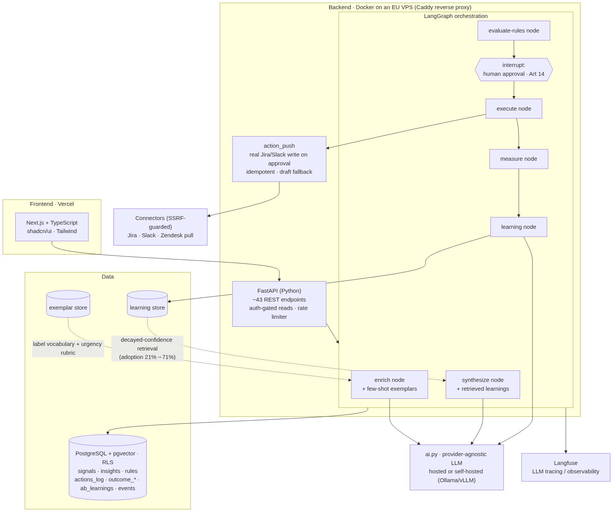
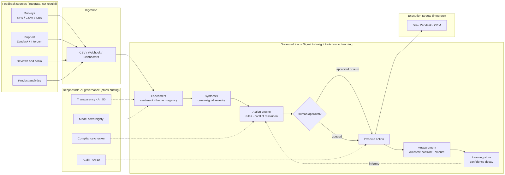
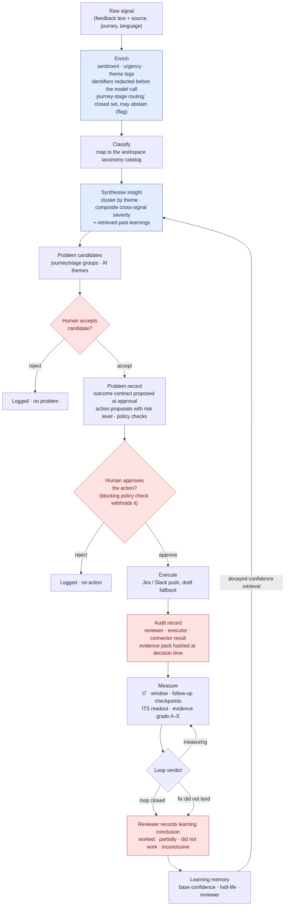
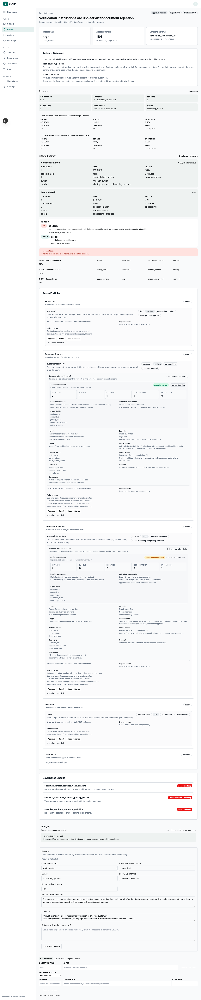

# Chapter 4: The Artifact

## 4.1 Overview

The artifact of this thesis is a working web platform that instantiates the complete **Signal → Insight → Action → Learning** cycle. Where Chapter 3 established *how* the artifact is evaluated, this chapter documents *what was built* and, more importantly, the non-trivial design decisions that constitute the design-science contribution (Hevner, March, Park, & Ram, 2004, Guideline 6). The platform is multi-tenant by construction: all data is scoped to a workspace through row-level security.

The system is implemented as **CLARA** (a backronym: *Capture, Listen, Analyze, Respond, Adapt*): a Next.js / TypeScript front end (shadcn/ui + Tailwind) on a Python **FastAPI** backend (≈89 REST endpoints across seven routers) with **LangGraph** orchestrating the language-model stages, Postgres for storage (with **pgvector** on the taxonomy nodes; Appendix E), and **Langfuse** for LLM tracing/observability. The pipeline's human-approval step is a LangGraph *interrupt* node; model routing is provider-agnostic (`ai.py`). The configured production default is a hosted European model (`mistral-small-latest`); every accuracy figure in Chapter 5 was produced on a different model (GLM-5.2, via a gateway), a gap §6.4 records. In production (since July 2026) the front end runs on Vercel and the API in Docker on a European VPS behind a TLS-terminating reverse proxy, with the database in an EU (Frankfurt) region.

The platform is deliberately *not* a feedback dashboard. Its claim to contribution is the governed path from a raw customer signal to a *measured* outcome and a *codified* learning, the stretch of the chain where the literature locates the feedback-action gap (Bone et al., 2017) and organisational knowledge loss (Walsh & Ungson, 1991; Argote, 2013).

## 4.2 Architecture

The platform is organised as a pipeline of bounded stages, each with a clear interface (Figure 4.1):

| Stage | Responsibility | Mechanism |
|-------|----------------|-----------|
| Ingestion | Capture qualitative signals from the tools organisations already use | CSV/JSON import, an HMAC-signed public webhook, and five official-API pull connectors (§4.7); validation, language detection and an authenticity review that annotates rather than filters |
| Enrichment | Sentiment, urgency and theme tags per signal | Language-model enrichment with few-shot exemplars; direct identifiers (e-mail, phone, IP, account ids, street addresses) are redacted from the text before it reaches the model |
| Synthesis | Cluster related signals into theme insights | Tag-based clustering with composite, cross-signal severity; relevant past learnings retrieved into the prompt |
| Candidates | Turn insights and journey-stage groups into problem candidates a person accepts or rejects | Deterministic grouping plus persisted AI themes; a candidate becomes a problem only on human acceptance |
| Action | Propose actions with a risk level and route them to an owner | Action proposals on the problem record; policy checks run against each proposal |
| Approval | Human clearance of every action before anything leaves the system | LangGraph interrupt; an approval record per action, bound to the verified login; a blocking policy check withholds approval; optional four-eyes |
| Measurement | Establish whether the problem recurred after the action | Outcome contract proposed at approval; scheduled checkpoints; interrupted time series with an evidence grade |
| Learning | Keep what a reviewer concluded, with decaying confidence | Reviewed conclusions copied into a learning memory; confidence-weighted retrieval into synthesis |
| Governance | Make the loop's decisions attributable and inspectable | Policy rules, audit records with a hashed evidence pack, CSV export, an Article 50 status view, the model card, the works-council pack |

A consistent architectural principle separates **deterministic** logic (schema validation, policy checks, audit logging, action execution, outcome scoring), which lives in ordinary, testable code, from **bounded language-model reasoning** (enrichment, synthesis), which is confined behind a single provider-agnostic interface. This follows current guidance that production language-model systems should wrap model calls in deterministic workflows with explicit checkpoints and human oversight, rather than delegating control to free-roaming agents. It is also what makes the artifact *governable*: the points at which the system can act are finite, named, and individually auditable.

## 4.3 Non-Trivial Design Decisions

The design contribution is concentrated in five decisions that the literature does not resolve and that therefore had to be made, and defended, by design. The first four were identified at proposal time; the fifth (per-industry scoring profiles, §4.3.5) emerged from the cross-industry evaluation. Each is implemented in the deployed build as described here; where the first design cycle resolved a decision differently, §4.7 records the earlier design and why it was superseded.

### 4.3.1 Graduated authority: every action is a draft

A system that can act on feedback must decide how much of that action it is allowed to take by itself. The deployed build answers with a single rule: **no action reaches an external system without a recorded human approval.** Every action proposal on a problem carries an owner, a destination and a risk level; approving it is a LangGraph *interrupt* that the graph cannot pass on its own, and the approval is an append-only record bound to the reviewer's verified login. Authority is graduated by the *consequence class* of the action rather than by a per-rule automation flag: a low-risk proposal needs one approver; a workspace can require two distinct approvers (four-eyes) for consequential actions; a proposal that fails a *blocking* policy check cannot be approved at all until the check passes. Feedback rules exist as inspectable configuration (a name, conditions, an action and a priority, listed by priority), and they inform routing, but they never fire an action unattended. The design therefore sits at a fixed, low level on the automation scale of Parasuraman, Sheridan, and Wickens (2000): the computer proposes and ranks, the human decides, and what varies is the depth of review, not whether review occurs. The first design cycle had taken the other route, a rule engine with an `auto_execute` flag and a priority → specificity → action-type conflict resolver; it is described, and its retirement explained, in §4.7. The reason the deployed build stops at approval is empirical as much as regulatory: the routing accuracy the pipeline reaches (§5A.4.1) is that of a useful draft, not of a decision that should run unattended.

### 4.3.2 Confidence decay in learnings

An A/B result that held two years ago may not hold today. Each learning stores `last_validated_at` and a `half_life_days`, and a **decayed confidence** is computed on read using exponential decay (`base × 0.5^(age / half_life)`). Learnings past their half-life are flagged "stale". This treats organisational memory as *perishable* rather than permanent, consistent with work on knowledge depreciation (Argote, 2013) and the temporal validity of organisational memory (Walsh & Ungson, 1991). It is a deliberately transparent, inspectable alternative to opaque recency weighting: a practitioner can see *why* a once-reliable learning has been down-weighted. The novelty claim is stated precisely. Decay-based machine memory itself has prior art: MemoryBank applies Ebbinghaus-style forgetting to LLM conversational memory (Zhong et al., 2024). This design's contribution is the *application*: exponential **evidence-confidence** decay over organisational action-outcome learnings, surfaced under governance into future action decisions rather than used for dialogue recall.

The shipped loop is *operational and instrumented*. Learnings persist in a dedicated store (`services/learning_store.py`; the decay itself is computed on read in `services/learning_engine.py`) and are retrieved into synthesis, and the in-repo evaluation measures their influence: retrieval raised the share of a past learning's remedy appearing in new recommendations from 21% to 71% (66.7% adoption; alignment lift 0.503 against a same-run noise floor). This is evidence that the memory is steering recommendations rather than decorating them (§5A.7). Two boundaries apply. The probe varied whether a learning was retrieved, not how old it was, so it measures retrieval rather than perishability; decay is unit-tested but its effect on recommendations is not yet measured (§6.4). And only conclusions a *person* recorded are retrieval-eligible: learnings the measure → learn path derives automatically are stored but never retrieved, a gate added so that an unvalidated causal claim cannot launder itself into the next recommendation. Outcome data behind those learnings remains simulated; proving a remedy *better* still requires measured outcomes.

### 4.3.3 Cross-signal severity scoring

A single insight may be corroborated by many signals of differing urgency, and a flat severity loses this. The synthesis stage computes a **composite severity** from the strongest member urgency, the volume of corroborating signals, and the proportion of negative sentiment, and maps the score to a severity band. The design draws on the data-fusion taxonomy (Bleiholder & Naumann, 2008) and anomaly consolidation (Chandola, Banerjee, & Kumar, 2009): severity emerges from the *set* of signals rather than any one, which mitigates both single-loud-complaint over-escalation and the dilution of widespread, low-urgency issues.

Two July-2026 refinements harden this scoring against its known failure modes. Because the composite score is volume-dominated, an **emerging-problem corroboration floor** now additionally requires ≥ 2 sources or ≥ 3 identified customers before an insight can grade "act now". A single-source burst is held at "watch" with a stated reason rather than escalated. And **near-duplicate detection** at import (token-set Jaccard ≥ 0.85, including intra-batch pairs) *annotates* suspected duplicates with metadata plus a "possible duplicate" badge, but never drops a signal. Silent deduplication would trade an inflation bias for a deletion bias, so the design surfaces the judgement to the human instead.

### 4.3.4 Relevant past-learnings retrieval

When a practitioner plans a new action, the system should surface what is already known. Learnings are ranked by lexical overlap between the theme under synthesis and each learning's topic and tags, weighted by decayed confidence, and the top-ranked eligible learnings are placed in the synthesis prompt and shown in the problem's learning panel. The design is an information-retrieval problem (Salton & McGill, 1983) framed as case-based reasoning (Kolodner, 1993) and knowledge reuse (Markus, 2001).

The deployed ranker is a deterministic **token-overlap scorer** re-weighted by decayed confidence: explainable, dependency-free, and adequate at the scale of a workspace's learning memory (tens to hundreds of entries). There is no embedding column on learnings; pgvector is used only for the taxonomy nodes, and semantic ranking over learnings is the designed upgrade path, not the shipped mechanism. A curated **few-shot exemplar store** (`services/exemplar_store.py`) additionally teaches the enrichment model the label vocabulary and urgency rubric as prompt text, with no embeddings or fine-tuning required. The evidence trail is reported plainly. On the original 60-case golden set the within-run A/B showed no statistically significant exemplar lift (McNemar p ≈ 1.0), an underpowered sample, documented as such in the evaluation ledger. After the set grew to 80 bilingual cases and two German exemplars were added, the exact-tag-set lift became significant in-run (8.75% → 28.75%, McNemar p = 0.001, 17 July 2026), while the urgency lift was underpowered at that size (p = 0.219) and was not claimed. At 100 cases the urgency lift reaches significance as well (83% → 90%, p = 0.039, in three same-day re-runs of the same items), and it is reported as exploratory from there, because the sample grew and the exemplar set changed between the two tests (§5A.7).

### 4.3.5 Per-industry scoring profiles

A triage system tuned for one sector mis-ranks another. A payment failure is existential for a neobank and routine for a DIY-adhesives brand; delivery latency dominates food delivery and barely registers in B2B manufacturing. Rather than fine-tune models per sector, the platform applies **per-industry weight profiles** over its eight-factor impact scoring: named profiles (fintech, food delivery, B2B manufacturing, SaaS) override only the weights that differ from the default, are selected per workspace, and remain inspectable and editable.

Implemented in `domain/industry_profiles.py`, four profiles ship (fintech, food delivery, B2B manufacturing, SaaS) over a default; three map one-to-one onto the thesis's evaluation datasets (Trade Republic → fintech, Lieferando → food delivery, Henkel → B2B manufacturing). The in-repo real-data evaluation shows industry-specific vocabularies emerging from the *enrichment* stage with no fine-tuning or per-sector configuration (§5A.7); that is evidence for the premise that sectors differ, not an evaluation of the weight profiles themselves, which act on impact scoring and have not been evaluated in any condition (§6.4).

The design is adaptation-by-configuration rather than retraining: a contingency-design stance (organisational fit varies by context) applied to triage, and the operational counterpart of the multi-metric, context-dependent view of customer-health measurement (De Haan, Verhoef, & Wiesel, 2015). *Cost:* profiles are hand-tuned priors. They encode the designer's beliefs about a sector, they can embed sector stereotypes as silently as they encode expertise, and they add a maintenance surface. The plain framing is that they trade one bias (one-size-fits-all) for another (authored priors), with inspectability as the safeguard.

A further decision, an **adaptive taxonomy**, is shipped in the database layer under the same graduated-authority stance as the action loop. Taxonomy nodes form a three-level hierarchy with a status (active, candidate, merged, archived), an origin (uploaded, seeded, discovered) and a confidence; a scheduled governance pass (`apply_taxonomy_governance`, run daily under pg_cron) auto-promotes *discovered* candidates whose confidence reaches 0.80, auto-merges near-duplicates at cosine similarity ≥ 0.95 and decays the confidence of nodes that stop matching, while uploaded taxonomy is never promoted, merged or archived automatically. Review, rename, lock, merge and split are human routes (§4.5). What remains future work is evaluating the taxonomy's behaviour over time, not building it.

## 4.4 Responsible AI Controls

Responsible AI is implemented as a property of the loop, not a bolt-on module (the human-in-the-loop path is shown end-to-end in Figure 4.4):

A preliminary on the legal references in this section: the artifact is not a high-risk system (§4.9), so the Chapter III obligations of the EU AI Act (Articles 8–15 and 17) do not bind it; they bind providers of high-risk systems (Article 16). Where this section names those articles it is describing design commitments adopted *voluntarily*, in the spirit of the codes of conduct the Act invites for non-high-risk systems (Article 95), and Appendix B labels each such row accordingly. The obligations that do apply are Article 4 (AI literacy), Article 5 (prohibited practices) and, for synthetic text, Article 50(2).

- **Human-in-the-loop approval.** Every action proposal requires an explicit human approval before anything leaves the system (§4.3.1); there is no automated path around the approval interrupt, and a blocking policy check withholds approval until it passes. This is designed to the standard Article 14 sets for high-risk systems, adopted here as a commitment rather than an obligation. Because awareness-based oversight measures are unlikely to counter automation bias on their own (Laux & Ruschemeier, 2025), the gate adds friction and traceability in line with the actionable properties of meaningful human control (Siebert et al., 2023): the approver sees the evidence, the policy-check results and the model score (renamed from "confidence"; see below), and the decision is individually attributable in the approval record.
- **Audit trail.** Every approval and execution is an append-only workflow record naming its reviewer (a pseudonym derived from the verified login) or executor, the connector result and an audit block, and the evidence pack an approver saw is content-hashed at decision time (below). This is the auditable record of decisions that the logging expectation of **Article 12** describes for high-risk systems, adopted voluntarily; it also supplies the contestability that GDPR **Article 22** presumes for the decisions it covers, which this artifact does not make (Appendix B).
- **Transparency.** Every AI-derived output carries provenance metadata (model, source, stated limitations) in its stored audit block, and the interface labels the model score as a heuristic. Which paragraph of **Article 50** this engages is analysed in Appendix B: only Article 50(2), for synthetic text a deployer chooses to publish, is potentially engaged; internal tickets and messages are not.
- **Outcome contract and closure levels.** Each action captures its metric and measurement window at creation. The measurement stage later scores resolution and distinguishes **operational**, **customer**, and **outcome** closure, so "closed loop" denotes a measured improvement, not merely a created ticket. Contracts are proposed automatically at approval time (trailing-rate baseline, a 30-day window with a T+7 early read), are editable and declinable by the approver, and are scored by the quasi-experimental ITS design specified in §3.5.5, whose honesty rules refuse a confidence interval when the data cannot support one.
- **Policy rules and regulatory status.** A seeded, editable store of policy rules runs against every action proposal; a rule marked blocking (for example a compliance concern on a customer-facing action class) withholds approval until it is cleared, and every check result is stored on the problem. An `/article50-status` view reports the workspace's transparency posture, and audit records export to CSV. There is no embedded regulatory knowledge base and no automated legal assessment of use cases; the regulatory analysis is documentation (Appendix B), kept current by the author, not by the product.
- **Model sovereignty.** All language-model calls run through a provider-agnostic, OpenAI-compatible client configured by environment. The platform can run on a hosted API or a fully self-hosted local model (Ollama/vLLM), and a fail-closed residency gate (`CLARA_AI_REQUIRE_EU=1`) refuses a provider whose endpoint the residency classifier cannot place in the EU or on the deployer's own host, at boot and in Settings. Two honest qualifications: the configured production default is a hosted European provider, and the gateway on which every accuracy figure in Chapter 5 was produced is classified "unknown" by that same classifier; no self-hosted or EU-hosted model has yet been run on either gold set (§6.4).
- **Ingestion authenticity review, and a refusal.** Incoming signals are reviewed before triage for provenance, exact duplication, volume bursts against a source's own trailing median, and batch-level structural uniformity, with findings annotated rather than acted on. The design decision that matters is what the review declines to do. Asked to flag which verbatims a language model wrote, I built the two candidate detectors and measured them on 6,740 real feedback texts before shipping either. A conventional stylometric detector tuned to 81% recall flagged 15.0% of genuine customer reviews, which at a realistic 1-5% contamination rate means 78 to 95 of every 100 flags lands on a real customer; its false flags skewed toward angrier reviews (mean 2.21 stars against 2.70), and its flag rate varied 3.0x across languages because the feature lexicon encoded English and German cues and not Greek or Czech ones. A Binoculars-style cross-perplexity detector (Hans et al., 2024) scored AUROC 0.326 on the English stratum, worse than chance, because complaint text is formulaic and therefore sits at the low-perplexity end where that method expects machine text; the sign of the signal inverts between English and German, so no single threshold can be correct in both. Per-comment authorship attribution is therefore **not implemented**, and the gate abstains outright below ten words, which covers 23% of a real corpus. The reasoning is the same one §3.5.5 applies to an underpowered regression: a labelled refusal is more honest than a confident answer the evidence cannot support. The component has been wired into every ingestion path (import, webhook and the pull connectors) since 21 August 2026.

A further hardening cycle (17 July 2026; twenty pull requests, prompted in part by the external-review episode of §4.9) extended these controls along four fronts:

- **Measurement honesty.** Every outcome readout now carries an **evidence grade** (A–E) that grades the measurement *design*, not the result: A randomised holdout; B controlled quasi-experiment (reserved; the platform has not yet produced one); C interrupted time series; D uncontrolled before/after; E manual assertion or unmeasured. On the outcome board the grade is computed from the contracted design and the measurement's **provenance**; on the problem detail, which runs the interrupted-time-series fit, it is re-graded on the fit actually obtained, so an ITS contract whose series was too sparse to fit reads D (a labelled before/after delta), never C. The detail readout also carries a placebo-in-time refit inside the pre-window and a volume-adjusted share series, so a "significant" effect where nothing happened, or an improvement that is really a platform-wide drop in inflow, is visible next to the estimate; and a follow-up checkpoint 30 days after the window catches a theme that goes quiet and then returns. Each measurement is either *instrumented* (scheduler-computed from signals) or *manual*; manual values are labelled "unverified manual observation" in the interface, and the API route force-stamps the manual label so provenance cannot be spoofed by a client. Declared **guardrail metrics**, previously declared but never measured (another declared-versus-enforced gap), are now checked at every checkpoint: `repeat_signal_rate` (post-execution theme signals per day from customers seen in the 28-day pre-window; identity-less signals are excluded because they cannot prove a repeat complainer) is tested for *non-inferiority* against the pre-window baseline, with breach defined as > 20% relative worsening, informative and never blocking, and an unmeasurable guardrail surfaces an explicit "no data source" marker rather than a silent pass. A **detectability note** at contract proposal (a two-sample Poisson normal-approximation minimum detectable effect at 80% power, explicitly labelled a heuristic rather than a formal power analysis) flags underpowered measurement windows before approval; it is a *lower* bound on what the segmented-regression estimator can detect, whose own variance puts the break-even for the default contract near 37.6 signals per day for one theme (§3.5.5). Degenerate states are guarded: the zero-baseline/zero-target/zero-measured case reads "not measured" instead of "target met", and signal-rate contracts are direction-guarded so a recurrence after a zero baseline can never read as success.
- **Attributable, tamper-evident approvals.** Approval reviewer identity is now bound to the verified login (a JWT-derived pseudonym, e.g. `user-3fa2b1c9`). It was previously self-asserted in the request body, so any editor could have signed as someone else, a declared-but-unenforced control of exactly the kind §4.9 documents. An opt-in, admin-only **four-eyes** mode requires two distinct approvers for consequential actions: the first approval is recorded but holds execution, a reviewer confirming their own approval is rejected, and a rejection resets the tally. Every evidence pack carries a canonical **sha256 content hash** (stable across re-exports of unchanged records), and the approval route stamps the pre-decision hash on the append-only approval record, so whether the pack an approver saw has since changed is *provable* rather than assumed.
- **Trust calibration.** The interface label "confidence" was renamed **"model score"**, with an explanation that the value is an uncalibrated heuristic (an LLM self-report blended with volume and source counts), not a validated probability. Model confidence scores are typically miscalibrated (Guo, Pleiss, Sun, & Weinberger, 2017), and presenting a heuristic as a probability invites the miscalibrated trust the oversight design tries to prevent (Lee & See, 2004). The AI-literacy module explains the distinction. Its EU AI Act copy was likewise corrected from "discharges your team's AI-literacy duty" to "supports your Article 4 programme" (in English and German), because the module records only a workspace-level pack-delivery attestation and deliberately tracks no per-user completion.
- **Worker-facing transparency and the perimeter.** Works-council mode is an opt-in workspace setting, off by default, and the pack it produces is written to support a works agreement (*Betriebsvereinbarung*) rather than to obviate one: the module's own documentation notes that co-determination under §87(1) Nr. 6 BetrVG can attach regardless, because approval records and an audit trail are objectively capable of monitoring conduct. The pack gained German technical annexes: a code-verifiable *no-individual-performance-monitoring* attestation, naming which fields the fail-closed redaction middleware replaces with role labels, list-collapse against person counting, a k = 5 small-cell suppression helper, pseudonymous approver identity, and the deliberate absence of per-user AI-literacy completion tracking, with a limits section stating what is not covered (the designated admin role still sees identities; admin-access logging is not yet built) and a control × setting × enforcement-site × proof feature matrix. A CI "walker" test calls every GET endpoint as a non-admin and fails if any person-capable field leaks: the attestation is continuously evidenced, not asserted once. The same cycle hardened the session perimeter (HttpOnly `SameSite=Lax` cookie sessions replacing localStorage tokens, flag-gated and enabled in production; TOTP multi-factor authentication with an optional server-side AAL2 mandate; connector secrets encrypted at rest with a fail-loud missing-key path; security headers on web and API; a fail-closed boot guard when authentication is unconfigured). Programmatic access follows the same philosophy: an **MCP server** exposes eight strictly read-only tools (including the content-hashed evidence pack and the published model-card metrics) behind revocable, role-scoped API keys, and a test pins the tool surface so that no approve/execute/delete tool can ever appear. The governance boundary is expressed as a test.

The compliance posture is documented in full in the EU AI Act / GDPR mapping (Appendix B) and the Data Protection Impact Assessment template (Appendix C).

## 4.5 Data Model

The deployed data model is drawn in Figure 4.5, and Appendix E extracts its DDL from the migrations and the API's boot-time schema rather than from a design sketch. Two conventions shape it. Domain aggregates (signals, theme insights, problems, workflow records, learnings) are stored as one JSONB document per row, keyed per workspace, and validated on every read and write by the pydantic model that is the aggregate's real schema. And every table carries a workspace (or tenant) key that leads its primary key, with row-level security enabled and forced, so a query can only see its own tenant's rows whichever store issued it.

**Signals** are the ingested feedback: text, source, journey and journey stage, language, timestamp, pseudonymous customer and account identifiers, and the enrichment written back by triage (sentiment, urgency, tags). Only the identifier and the text are required, so an arbitrary CSV imports; unmapped columns are kept as metadata. **Theme insights** are the synthesised clusters, one row per workspace and theme tag, and they surface as problem candidates beside the deterministic journey-stage groups. A **problem** is what a person accepted: it carries the evidence, the affected cohort, the impact factors, the action proposals with their risk levels and approval state, the policy-check results, and the **outcome contract** (metric, baseline, success threshold, window, comparison method, guardrails, responsible owner). Everything the loop then does to a problem is a typed **workflow record**: approval, execution, transition, outcome measurement (with its instrumented-or-manual provenance), guardrail measurement, closure and learning conclusion, each named for its reviewer or executor and each carrying a retention date. **Measurement plans** are the scheduled checkpoints (T+7, window, follow-up). **Learnings** are reviewed conclusions copied into the retrieval memory with their base confidence, half-life and last validation date.

The **taxonomy** is a three-level structure (category → theme → subtheme) held in `taxonomy_nodes`, the one table with an embedding column (1,024 dimensions after migration 012). It is adaptive under graduated authority (§4.3.5): discovered candidates are auto-promoted at confidence 0.80 and near-duplicates auto-merged at cosine similarity 0.95, both logged and reversible; uploaded taxonomy is never changed automatically; review, rename, lock, merge and split are human routes; and node confidence decays from its last validation. The thesis's gold-set evaluation (Chapter 5) scores the enrichment pipeline's `theme` and `journey-stage` assignments against the datasets' own seed labels, not against this structure.

## 4.6 Evaluation Instrumentation

To support the task-based evaluation (Chapter 3), the platform records a telemetry stream of about twenty-five event types, among them candidate acceptance, approval decisions (`approval_recorded`, the approval-cycle-time denominator), executions, measurement checkpoints and loop verdicts, with no person identifier on any row. It does not record rule creation, learning retrieval or a time-to-action field: time-to-action is derived offline from the approval and transition timestamps. An exported event log feeds the prototype-metrics analysis (`evaluation/`), alongside facilitator-recorded data and the SUS instrument. The enrichment stage is additionally exercised by the offline gold-set harness (Chapter 5, §5A), which scores two predictors that must not be confused: a generic triage prompt on the same model (`predict_llm.py`), and the artifact's own `enrich_signals` stage with its prompt, exemplars and sanitiser (`predict_llm_production.py`, §5A.2).

## 4.7 Design as a Search Process

Consistent with Hevner et al.'s (2004) sixth guideline, the artifact was built through build-evaluate cycles, and several scope decisions are themselves findings. An earlier, complete instantiation of the same design, a React/Vite single-page application on Supabase Edge Functions, served as the first design-cycle iteration. The platform documented here superseded it and carried forward its deliberately simple token-overlap retrieval as the ranker of §4.3.4. One design it did *not* carry forward is worth recording, because Chapter 6 abstracts a principle from the difference. The first iteration governed action with a rule engine: each rule declared an `auto_execute` flag, matching rules were ranked by priority, ties broken by specificity (number of conditions) and duplicates removed by action type, superseded rules were logged, and an action whose rule allowed it fired without review. It was a faithful instantiation of production-rule conflict resolution (Forgy, 1982; Boyer & Mili, 2011). The deployed build retired it for two reasons. The routing accuracy the evaluation measured (§5A.4.1) is that of a draft, so a flag that lets a rule fire unattended would automate the pipeline's least reliable judgement; and a rule set's transparency pays off only if someone maintains it, whereas an approval record is produced by the act of deciding. Rules survive as configuration that informs routing; authority is graduated by consequence class at the approval step instead (§4.3.1). The platform deliberately *integrates with*, rather than replaces, collection and delivery tools. Connector status differs by direction. The action side of the loop is **live**: when a human approves an action and a destination connector is configured, `services/action_push.py` performs the real external write (Jira issue, Slack message) from the normal approval flow. Pushes are idempotent, push failures are recorded on the execution rather than failing the approval, and the system falls back to a local draft when no connector is configured. A production defect in which the approval interrupt was never resumed, leaving the action → measure → learn stages unreachable in the deployed system, was found by review and fixed, so the outcome loop now runs end-to-end in production. A second wiring defect of the same species was discovered in the July 2026 review cycle (§4.9): triage enrichment (sentiment, urgency) was computed in pipeline state but never persisted to the signal store, so the feed's "enriched" state read permanently zero even while enrichment ran. The fix persists the fields at write time. It is recorded here as a defect found and fixed, not a capability designed. Connector *pulls* cover five sources through official APIs, with no scraping: Zendesk (with pagination), Trustpilot (implemented against the official API and awaiting a customer's business-unit credentials to run live), the Apple App Store, Google Play, and Google Business Profile, alongside CSV import and an HMAC-signed public webhook. CRM-side integration is narrower: HubSpot exists only as a local draft destination (drafted segments and emails a human carries over), and no Typeform or Intercom integration is built.

The remaining integrations were judged unnecessary for evaluating the design concept and a poor use of the thesis timeline. These boundaries are documented so the contribution is legible as a *situated instantiation* of a governed loop-closure design, not as a finished commercial product.

## 4.8 A Worked Example

To make the loop concrete, consider one real signal from the evaluation corpus (Trade Republic, paraphrased and de-identified):

> *"Transaction history cannot be exported to CSV or Excel, limiting independent analysis and recordkeeping."*

The signal is **ingested** from the Apple App Store source and **enriched**: the language model assigns negative sentiment, a *transaction-export-missing* theme, and medium urgency, and extracts the quoted span as evidence. It is **mapped** to the taxonomy under *reporting → export*. During **synthesis** it clusters with several other export-related signals; the composite cross-signal severity (DP3) rises above any single member because the issue is corroborated by volume, not loudness. The clustered insight surfaces as a **problem candidate**; a reviewer **accepts** it, and the problem record carries an action proposal, *create-backlog-item* routed to the *investment-product* owner, with a risk level and the results of the policy checks. Nothing fires yet: the proposal waits at the approval interrupt (DP4). A product manager **approves** it from the queue, and at that moment the system proposes the **outcome contract** (DP1): metric = the daily rate of export-related signals, baseline = the trailing rate over the last 28 observed days, window = 30 days with a T+7 early read, success = a 50% reduction; the approver can edit or decline it. The system **executes** by creating the Jira backlog item with the verbatim evidence attached (a real external write when a Jira connector is configured, a local draft otherwise; §4.7) and **writes an approval and an execution record** naming the approver, the input evidence (content-hashed as the approver saw it) and the connector result. At each checkpoint **measurement** recomputes the rate from raw signals and fits the interrupted time series (§3.5.5), refusing to fit and grading the readout D if the series is too sparse. If export complaints fall and stay down through the follow-up read, the loop verdict is *loop closed*; the reviewer then records a **learning conclusion** ("adding CSV export reduced reporting complaints", status *worked*, with its limitations), which enters the learning memory with a configurable half-life (180 days by default; DP2), to be **retrieved** (weighted by decayed confidence) the next time a similar reporting gap is synthesised. The artifact's gold-label seeds for this signal (`theme = transaction_export_missing`, `journey = reporting`, `owner = investment_product`, `action = add_csv_export`, `risk = medium`) are exactly the fields the Chapter 5 evaluation scores the enrichment against, which ties this demonstration to the quantitative results.

The running system is shown below: Figure 4.6 is one problem end-to-end (evidence, affected customers, proposed actions, and the per-action approval and governance/consent gates); Figure 4.7 is the Outcome Board before any measurement window has closed (screenshots, July 2026). Both screenshots show the seeded demonstration workspace that ships with the repository (`data/sample_customer_context.json` and the seed problems): the account names, customer identifiers, account values and consent statuses in Figure 4.6 are fictitious fixtures, not live customer data, and no evaluation dataset appears in either figure.

## 4.9 Risk Classification, Threat Model, and Failure Modes

**EU AI Act risk tier.** A structured reading of Annex III places the artifact **outside the high-risk category**: it performs no biometric categorisation, no safety-critical-infrastructure control, no decisioning on access to education, employment, essential private or public services, credit, or law enforcement *about identified individuals*. Its outputs are internal operational routing (a backlog item, an owner, a priority), with human approval for consequential actions. The obligations that apply are therefore Article 4 (AI literacy), the **Article 5 prohibitions**, and **Article 50(2)** where a deployer publishes synthetic text the system drafted; Article 50(1), (3) and (4) are not engaged by internal routing (Appendix B). Article 5(1)(b) is closed to the exploitation of vulnerabilities due to age, disability or a specific social or economic situation; a churn-risk segment is not such a group, so the prohibition does not reach ordinary retention outreach. The design nonetheless adopts a stricter *policy* constraint than the law imposes: the action layer must not be used for subliminal, manipulative or exploitative outreach at all, and customer-facing action classes carry a blocking policy check. This classification is a defended position, not a self-exemption, and it is the author's reading, documented in Appendix B and revised there when the regulatory text moves.

**Threat / abuse model.** The capability that makes the artifact useful, taking action, is also its principal risk surface.

| Threat | Mitigation in the design | Residual risk |
|---|---|---|
| Manipulative or exploitative customer outreach (the Article 5 concern, and the stricter house policy) | Blocking policy checks on customer-facing action classes; mandatory approval for every action; optional four-eyes | A dark-pattern *enforcement* gate is future work (Ch 6) |
| LLM hallucination in enrichment → mis-routing | Human approval, audit trail, surfaced model score (labelled an uncalibrated heuristic, §4.4); §5A shows triage must be learned and monitored, not assumed | Open-vocabulary fields least reliable |
| Automation bias / rubber-stamping at the approval gate | Rationale + evidence shown with each item; no unattended path; optional four-eyes dual approval (§4.4); periodic audit sampling of approvals | Behavioural, not fully eliminable by design |
| PII leakage to the model | Direct identifiers (e-mail, phone, IP, account ids, street addresses) redacted from the text before enrichment and synthesis; model sovereignty (self-hostable); retention limits | Pattern-based redaction, not named-entity recognition: a name in running text is not caught; depends on deployment choice |
| Poisoning via the public ingestion webhook | Workspace-scoped RLS; schema validation; rate/credential checks | Public endpoints remain an attack surface; see the review-then-harden account below |
| Machine-generated or coordinated feedback injected to steer insights | Ingestion authenticity review (§4.4): provenance, duplication, burst and batch-uniformity findings, annotated for a human decision; the emerging-problem corroboration floor already requires two sources or three identified customers before an insight can grade "act now" | A varied batch of machine-written text with no duplication is not detectable, and the measurements in §4.4 indicate no available method detects it reliably at verbatim length |

**Verification in practice: review, then harden.** The threat model above was stress-tested against the artifact itself. A structured code review of the platform (2 July 2026; `docs/archive/code-review-2026-07-02.md`) confirmed 58 defects, ten of them high severity, including unauthenticated read endpoints, an authentication guard enforced only client-side, and row-level security that was *declared but not effectively enforced* because the API connected as the table owner. A targeted hardening pass followed within days: read endpoints gated behind authentication, a per-workspace rate limiter, SSRF guards in the connector base, and a migration backfilling RLS across all public tables. Two lessons are carried into the design account. First, several mitigations this chapter lists existed *on paper* before they held *in practice*. Declared controls are not enforced controls, and only adversarial verification exposed the difference. Second, the same review found the approval-interrupt defect that had silently disabled the outcome loop in production (§4.7). The governance instrumentation (audit trail, telemetry) is what made both failures visible and fixable. The residual position is stated plainly: the platform is hardened for the evaluation context but is not warranted as production-multi-tenant, and the remaining medium-severity findings are tracked in the review document.

**A second, external verification episode (16–17 July 2026).** The review-then-harden pattern was later repeated with outside eyes. Two *independent* LLM-based strategic reviews of the deployed artifact were obtained: one product/market-focused (17 concrete findings), one strategy-focused with dimension scores rating, i.a., scientific validity 2/10 and security 3/10. Rather than accepting either verdict, the reviews' factual claims were adversarially verified against both the codebase and the live deployment before any were acted on. The verified findings were ranked into a 38-item response plan, and twenty pull requests closed every code-reachable item. **The episode's claim-by-claim results, and what they license as evidence, are reported once, in §5A.8.** This section records only its consequence for the artifact. That consequence is visible in §4.4: several of the July controls above trace directly to findings the reviews raised about the trust and credibility layer. Two recommendations were declined with documented reasons (building survey capture; configurable autonomy levels). No methodological novelty is claimed for the episode. It was an additional, naturalistic ex-post input to a further design cycle, complementary to the designed evaluations of Chapters 3 and 5.

**Failure modes.** When measurement is **inconclusive** (no clear movement within the window, or a series too sparse to fit), the problem is *not* marked resolved: the readout says so, the evidence grade says what kind of evidence exists, and the loop verdict stays open rather than silently closing. Closure is asserted only on evidence. **Conflicting rules** are not resolved by the system at all: rules inform routing, and the decision between competing proposals belongs to the reviewer at the approval step (DP4). **Stale learnings** are down-weighted by decay (DP2) rather than silently trusted. These behaviours are deliberate: the system is designed to fail *visibly and safely*, to decline to claim closure, rather than to manufacture a tidy but unwarranted result.
