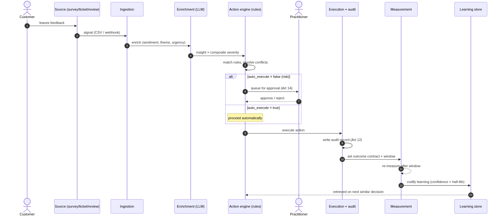
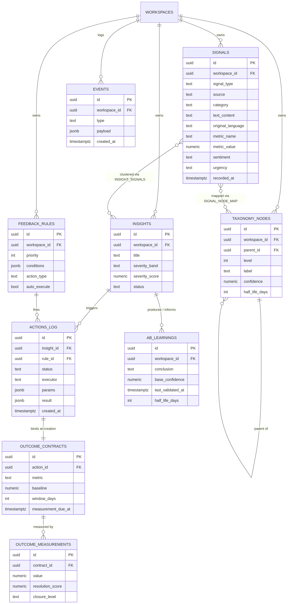
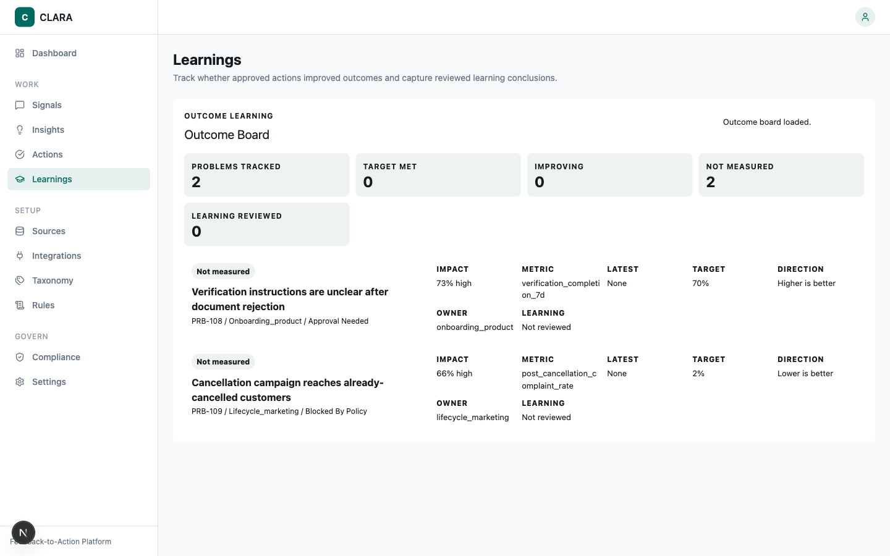

# Chapter 4: The Artifact

## 4.1 Overview

The artifact of this thesis is a working web platform that instantiates the complete **Signal → Insight → Action → Learning** cycle. Where Chapter 3 established *how* the artifact is evaluated, this chapter documents *what was built* and, more importantly, the non-trivial design decisions that constitute the design-science contribution (Hevner, March, Park, & Ram, 2004, Guideline 6). The platform is multi-tenant by construction: all data is scoped to a workspace through row-level security.

The system is implemented as **CLARA** (a backronym: *Capture, Listen, Analyze, Respond, Adapt*): a Next.js / TypeScript front end (shadcn/ui + Tailwind) on a Python **FastAPI** backend (≈84 REST endpoints; `docs/repo-map.md`) with **LangGraph** orchestrating the language-model stages, Postgres + **pgvector** for storage and semantic retrieval, and **Langfuse** for LLM tracing/observability. The pipeline's human-approval step is a LangGraph *interrupt* node; model routing is provider-agnostic (`ai.py`). In production (July 2026) the front end runs on Vercel and the API in Docker on a European VPS behind a TLS-terminating reverse proxy, with the database in an EU (Frankfurt) region.

The platform is deliberately *not* a feedback dashboard. Its claim to contribution is the governed path from a raw customer signal to a *measured* outcome and a *codified* learning, the stretch of the chain where the literature locates the feedback-action gap (Bone et al., 2017) and organisational knowledge loss (Walsh & Ungson, 1991; Argote, 2013).

## 4.2 Architecture

The platform is organised as a pipeline of bounded stages, each with a clear interface (Figure 4.1):

| Stage | Responsibility | Mechanism |
|-------|----------------|-----------|
| Ingestion | Capture qualitative and quantitative signals | CSV import, a public ingest webhook, and connector configurations |
| Enrichment | Sentiment, theme, urgency, evidence per signal | Language-model enrichment + PII masking |
| Synthesis | Cluster related signals into insights | Clustering with composite, cross-signal severity |
| Action | Match rules, resolve conflicts, execute or queue | Rule engine over conditional automation rules |
| Approval | Human-in-the-loop clearance for risky actions | Action log with a `pending_approval` state |
| Measurement | Score whether the issue improved after the window | Outcome contract + resolution scoring |
| Learning | Codify A/B outcomes with decaying confidence | Learning store + confidence-weighted retrieval |
| Governance | EU AI Act + GDPR assessment of use cases | Embedded compliance knowledge base |

A consistent architectural principle separates **deterministic** logic (schema validation, conflict resolution, audit logging, action execution, outcome scoring), which lives in ordinary, testable code, from **bounded language-model reasoning** (enrichment, synthesis, learning extraction), which is confined behind a single provider-agnostic interface. This follows current guidance that production language-model systems should wrap model calls in deterministic workflows with explicit checkpoints and human oversight, rather than delegating control to free-roaming agents. It is also what makes the artifact *governable*: the points at which the system can act are finite, named, and individually auditable.

## 4.3 Non-Trivial Design Decisions

The design contribution is concentrated in five decisions that the literature does not resolve and that therefore had to be made, and defended, by design. The first four were identified at proposal time; the fifth (per-industry scoring profiles, §4.3.5) emerged from the cross-industry evaluation. Each is implemented, and each is grounded in theory.

### 4.3.1 Rule conflict resolution

When several rules match the same insight, the engine must decide which fires, or the system will either over-act (duplicate tickets, alert fatigue) or under-act. The engine ranks matched rules by **priority**, breaks ties by **specificity** (number of conditions), and then deduplicates by **action type** so that each action type fires at most once. Superseded rules are recorded and returned for inspection. This is a pragmatic instantiation of conflict-resolution strategies from production-rule systems (Forgy, 1982; the Rete match/resolve/act cycle) and business-rule management (Boyer & Mili, 2011), and it operationalises a graduated notion of automation authority (Parasuraman, Sheridan, & Wickens, 2000): more specific, higher-priority rules dominate, and the resolution is transparent rather than emergent.

### 4.3.2 Confidence decay in learnings

An A/B result that held two years ago may not hold today. Each learning stores `last_validated_at` and a `half_life_days`, and a **decayed confidence** is computed on read using exponential decay (`base × 0.5^(age / half_life)`). Learnings past their half-life are flagged "stale". This treats organisational memory as *perishable* rather than permanent, consistent with work on knowledge depreciation (Argote, 2013) and the temporal validity of organisational memory (Walsh & Ungson, 1991). It is a deliberately transparent, inspectable alternative to opaque recency weighting: a practitioner can see *why* a once-reliable learning has been down-weighted. The novelty claim is stated precisely. Decay-based machine memory itself has prior art: MemoryBank applies Ebbinghaus-style forgetting to LLM conversational memory (Zhong et al., 2024). This design's contribution is the *application*: exponential **evidence-confidence** decay over organisational action-outcome learnings, surfaced under governance into future action decisions rather than used for dialogue recall.

The shipped loop is *operational and instrumented*. Learnings persist in a dedicated store (`services/learning_store.py`) and are retrieved into synthesis, and the in-repo evaluation measures their influence: retrieval raised the share of a past learning's remedy appearing in new recommendations from 21% to 71% (66.7% adoption; alignment lift 0.503 against a same-run noise floor). This is evidence that the memory is steering recommendations rather than decorating them (§5A.7). Outcome data behind those learnings remains simulated; proving a remedy *better* still requires measured outcomes.

### 4.3.3 Cross-signal severity scoring

A single insight may be corroborated by many signals of differing urgency, and a flat severity loses this. The synthesis stage computes a **composite severity** from the strongest member urgency, the volume of corroborating signals, and the proportion of negative sentiment, and maps the score to a severity band. The design draws on the data-fusion taxonomy (Bleiholder & Naumann, 2008) and anomaly consolidation (Chandola, Banerjee, & Kumar, 2009): severity emerges from the *set* of signals rather than any one, which mitigates both single-loud-complaint over-escalation and the dilution of widespread, low-urgency issues.

Two July-2026 refinements harden this scoring against its known failure modes. Because the composite score is volume-dominated, an **emerging-problem corroboration floor** now additionally requires ≥ 2 sources or ≥ 3 identified customers before an insight can grade "act now". A single-source burst is held at "watch" with a stated reason rather than escalated. And **near-duplicate detection** at import (token-set Jaccard ≥ 0.85, including intra-batch pairs) *annotates* suspected duplicates with metadata plus a "possible duplicate" badge, but never drops a signal. Silent deduplication would trade an inflation bias for a deletion bias, so the design surfaces the judgement to the human instead.

### 4.3.4 Relevant past-learnings retrieval

When a practitioner plans a new action, the system should surface what is already known. Learnings are ranked by overlap with the query, weighted by decayed confidence, and surfaced both in a search interface and inline in the rule builder. The design is an information-retrieval problem (Salton & McGill, 1983) framed as case-based reasoning (Kolodner, 1993) and knowledge reuse (Markus, 2001).

Retrieval uses **pgvector** semantic similarity over learning embeddings, re-weighted by decayed confidence. A deterministic token-overlap scorer, the first design-cycle iteration's ranker, is retained as an explainable fallback. A curated **few-shot exemplar store** (`services/exemplar_store.py`) additionally teaches the enrichment model the label vocabulary and urgency rubric as prompt text, with no embeddings or fine-tuning required. The evidence trail is reported plainly. On the original 60-case golden set the within-run A/B showed no statistically significant exemplar lift (McNemar p ≈ 1.0), an underpowered sample, documented as such in the evaluation ledger. After the set grew to 80 bilingual cases and two German exemplars were added, the exact-tag-set lift became significant in-run (8.75% → 28.75%, McNemar p = 0.001, 17 July 2026), while the urgency lift was underpowered at that size (p = 0.219) and was not claimed. At 100 cases the urgency lift reaches significance as well (83% → 90%, p = 0.039, three consecutive runs), and it is claimed only from there (§5A.7).

### 4.3.5 Per-industry scoring profiles

A triage system tuned for one sector mis-ranks another. A payment failure is existential for a neobank and routine for a DIY-adhesives brand; delivery latency dominates food delivery and barely registers in B2B manufacturing. Rather than fine-tune models per sector, the platform applies **per-industry weight profiles** over its eight-factor impact scoring: named profiles (fintech, food delivery, B2B manufacturing, SaaS) override only the weights that differ from the default, are selected per workspace, and remain inspectable and editable.

Implemented in `domain/industry_profiles.py`, the three shipped profiles map one-to-one onto the thesis's three evaluation datasets (Trade Republic → fintech, Lieferando → food delivery, Henkel → B2B manufacturing), and the in-repo real-data evaluation shows industry-specific vocabularies emerging with no fine-tuning or per-sector configuration (§5A.7).

The design is adaptation-by-configuration rather than retraining: a contingency-design stance (organisational fit varies by context) applied to triage, and the operational counterpart of the multi-metric, context-dependent view of customer-health measurement (De Haan, Verhoef, & Wiesel, 2015). *Cost:* profiles are hand-tuned priors. They encode the designer's beliefs about a sector, they can embed sector stereotypes as silently as they encode expertise, and they add a maintenance surface. The plain framing is that they trade one bias (one-size-fits-all) for another (authored priors), with inspectability as the safeguard.

A further decision, an **adaptive taxonomy** (a self-improving category → theme → subtheme hierarchy with graduated, reversible auto-promotion and decay), is in progress and treated as design-forward future work (§4.6).

## 4.4 Responsible AI Controls

Responsible AI is implemented as a property of the loop, not a bolt-on module (the human-in-the-loop path is shown end-to-end in Figure 4.4):

- **Human-in-the-loop approval.** Rules declare an `auto_execute` flag. When it is false, actions are written as `pending_approval` and require explicit human clearance before they fire, satisfying the human-oversight expectation of **EU AI Act Article 14**, and deliberately exceeding it. Because Article 14's awareness-based measures are unlikely to counter automation bias on their own (Laux & Ruschemeier, 2025), the gate adds friction and traceability in line with the actionable properties of meaningful human control (Siebert et al., 2023): the approver sees the triggering rule, evidence, and model score (renamed from "confidence"; see below), and the decision is individually attributable in the audit record.
- **Audit trail.** Every action is recorded with its parameters, result, executor (`system_auto` vs. a user id), and status. This is an auditable record of automated decisions, consistent with the logging expectation of **Article 12** and the explainability direction of **GDPR Article 22**.
- **Transparency.** Every AI-derived output carries provenance metadata (model, source, stated limitations) and is labelled as machine-generated in the interface, consistent with **Article 50**.
- **Outcome contract and closure levels.** Each action captures its metric and measurement window at creation. The measurement stage later scores resolution and distinguishes **operational**, **customer**, and **outcome** closure, so "closed loop" denotes a measured improvement, not merely a created ticket. Contracts are proposed automatically at approval time (trailing-rate baseline, a 30-day window with a T+7 early read), are editable and declinable by the approver, and are scored by the quasi-experimental ITS design specified in §3.5.5, whose honesty rules refuse a confidence interval when the data cannot support one.
- **Compliance checker.** A `check-compliance` capability assesses a marketing use case against an embedded EU AI Act + GDPR knowledge base and returns scored findings and required actions. The knowledge base tracks the live regulatory state, including the 2026 Digital Omnibus on AI agreed by the Council and Parliament on 7 May 2026: the **Annex III high-risk** obligations were postponed from 2 August 2026 to **2 December 2027**, while the **Article 50 transparency obligations remain on their 2 August 2026 schedule**. The only Article 50 deferral is a four-month grace period (to 2 December 2026) for the **Article 50(2) machine-readable marking ("watermarking")** obligation on systems already on the market (Council of the European Union, 2026; Gibson Dunn, 2026).
- **Model sovereignty.** All language-model calls run through a provider-agnostic, OpenAI-compatible client configured by environment. The platform can run on a hosted API or a fully self-hosted local model (Ollama/vLLM), which addresses EU data-residency concerns with no dependency on a proprietary third-party runtime.

A further hardening cycle (17 July 2026; twenty pull requests, prompted in part by the external-review episode of §4.9) extended these controls along four fronts:

- **Measurement honesty.** Every outcome readout now carries an **evidence grade** (A–E) that grades the measurement *design*, not the result: A randomised holdout; B controlled quasi-experiment (reserved; the platform has not yet produced one); C interrupted time series; D uncontrolled before/after; E manual assertion or unmeasured. The grade is computed identically on the outcome board and the problem detail, from the comparison method and the measurement's **provenance**. Each measurement is either *instrumented* (scheduler-computed from signals) or *manual*; manual values are labelled "unverified manual observation" in the interface, and the API route force-stamps the manual label so provenance cannot be spoofed by a client. Declared **guardrail metrics**, previously declared but never measured (another declared-versus-enforced gap), are now checked at every checkpoint: `repeat_signal_rate` (post-execution theme signals per day from customers seen in the 28-day pre-window; identity-less signals are excluded because they cannot prove a repeat complainer) is tested for *non-inferiority* against the pre-window baseline, with breach defined as > 20% relative worsening, informative and never blocking, and an unmeasurable guardrail surfaces an explicit "no data source" marker rather than a silent pass. A **detectability note** at contract proposal (a two-sample Poisson normal-approximation minimum detectable effect at 80% power, explicitly labelled a heuristic rather than a formal power analysis) flags underpowered measurement windows before approval. Degenerate states are guarded: the zero-baseline/zero-target/zero-measured case reads "not measured" instead of "target met", and signal-rate contracts are direction-guarded so a recurrence after a zero baseline can never read as success.
- **Attributable, tamper-evident approvals.** Approval reviewer identity is now bound to the verified login (a JWT-derived pseudonym, e.g. `user-3fa2b1c9`). It was previously self-asserted in the request body, so any editor could have signed as someone else, a declared-but-unenforced control of exactly the kind §4.9 documents. An opt-in, admin-only **four-eyes** mode requires two distinct approvers for consequential actions: the first approval is recorded but holds execution, a reviewer confirming their own approval is rejected, and a rejection resets the tally. Every evidence pack carries a canonical **sha256 content hash** (stable across re-exports of unchanged records), and the approval route stamps the pre-decision hash on the append-only approval record, so whether the pack an approver saw has since changed is *provable* rather than assumed.
- **Trust calibration.** The interface label "confidence" was renamed **"model score"**, with an explanation that the value is an uncalibrated heuristic (an LLM self-report blended with volume and source counts), not a validated probability. Model confidence scores are typically miscalibrated (Guo, Pleiss, Sun, & Weinberger, 2017), and presenting a heuristic as a probability invites the miscalibrated trust the oversight design tries to prevent (Lee & See, 2004). The AI-literacy module explains the distinction. Its EU AI Act copy was likewise corrected from "discharges your team's AI-literacy duty" to "supports your Article 4 programme" (in English and German), because the module records only a workspace-level pack-delivery attestation and deliberately tracks no per-user completion.
- **Worker-facing transparency and the perimeter.** The works-council pack gained German technical annexes: a code-verifiable *no-individual-performance-monitoring* attestation, naming which fields the fail-closed redaction middleware replaces with role labels, list-collapse against person counting, a k = 5 small-cell suppression helper, pseudonymous approver identity, and the deliberate absence of per-user AI-literacy completion tracking, with a limits section stating what is not covered (the designated admin role still sees identities; admin-access logging is not yet built) and a control × setting × enforcement-site × proof feature matrix. A CI "walker" test calls every GET endpoint as a non-admin and fails if any person-capable field leaks: the attestation is continuously evidenced, not asserted once. The same cycle hardened the session perimeter (HttpOnly `SameSite=Lax` cookie sessions replacing localStorage tokens, flag-gated and enabled in production; TOTP multi-factor authentication with an optional server-side AAL2 mandate; connector secrets encrypted at rest with a fail-loud missing-key path; security headers on web and API; a fail-closed boot guard when authentication is unconfigured). Programmatic access follows the same philosophy: an **MCP server** exposes eight strictly read-only tools (including the content-hashed evidence pack and the published model-card metrics) behind revocable, role-scoped API keys, and a test pins the tool surface so that no approve/execute/delete tool can ever appear. The governance boundary is expressed as a test.

The compliance posture is documented in full in the EU AI Act / GDPR mapping (Appendix B) and the Data Protection Impact Assessment template (Appendix C).

## 4.5 Data Model

The platform's two core entities are **signals** and the **taxonomy** they are mapped to. The full entity-relationship model is shown in Figure 4.5, with runnable DDL in Appendix E (`diagrams/schema.sql`).

**Signals** capture customer feedback and metrics from up to thirteen source types: qualitative (NPS, CSAT, CES, open feedback, support tickets, app reviews, social mentions) and quantitative (email engagement, page analytics, A/B-test results, campaign metrics, segment movement, custom webhooks). A signal records its type, source, and category; its text content and original language; metric fields (name, value, baseline, delta, anomaly flag) for quantitative signals; entity and contact references; and enrichment fields (sentiment, sentiment score, urgency, tags). The downstream entities (insights, rules, actions, outcome contracts, outcome measurements, and learnings) are the artefacts the loop produces over signals.

The **taxonomy** is a three-level structure (category → theme → subtheme) that signals are mapped to during enrichment. In its adaptive form (future work, §4.3) it self-improves under graduated authority: high-confidence merges and promotions are applied automatically and logged reversibly, while lower-confidence candidates are queued for human review, and node confidence decays from its last validation. This is the structure against which the gold-set evaluation (Chapter 5) measures the enrichment pipeline's `theme` and `journey-stage` assignments.

## 4.6 Evaluation Instrumentation

To support the task-based evaluation (Chapter 3), the platform records an `events` telemetry stream (rule creation, approvals, status advances carrying time-to-action, measurement, and learning retrieval). An exported event log feeds the prototype-metrics analysis (`evaluation/`), providing objective time-to-action and task-completion measures alongside facilitator-recorded data and the SUS instrument. The enrichment and routing stages are additionally exercised by the offline gold-set harness (Chapter 5, §5A), which runs the same logic over the real labelled datasets.

## 4.7 Design as a Search Process

Consistent with Hevner et al.'s (2004) sixth guideline, the artifact was built through build-evaluate cycles, and several scope decisions are themselves findings. An earlier, complete instantiation of the same design, a React/Vite single-page application on Supabase Edge Functions, served as the first design-cycle iteration. The platform documented here superseded it, carrying forward its deliberately simple token-overlap retrieval as the explainable fallback of §4.3.4. The platform deliberately *integrates with*, rather than replaces, collection and delivery tools. Connector status differs by direction. The action side of the loop is **live**: when a human approves an action and a destination connector is configured, `services/action_push.py` performs the real external write (Jira issue, Slack message) from the normal approval flow. Pushes are idempotent, push failures are recorded on the execution rather than failing the approval, and the system falls back to a local draft when no connector is configured. A production defect in which the approval interrupt was never resumed, leaving the action → measure → learn stages unreachable in the deployed system, was found by review and fixed, so the outcome loop now runs end-to-end in production. A second wiring defect of the same species was discovered in the July 2026 review cycle (§4.9): triage enrichment (sentiment, urgency) was computed in pipeline state but never persisted to the signal store, so the feed's "enriched" state read permanently zero even while enrichment ran. The fix persists the fields at write time. It is recorded here as a defect found and fixed, not a capability designed. Connector *pulls* remain narrower: Zendesk pull works (with pagination), while HubSpot, Typeform, and Intercom remain credential-checked scaffolds.

The remaining scaffolds were judged unnecessary for evaluating the design concept and a poor use of the thesis timeline. These boundaries are documented so the contribution is legible as a *situated instantiation* of a governed loop-closure design, not as a finished commercial product.

## 4.8 A Worked Example

To make the loop concrete, consider one real signal from the evaluation corpus (Trade Republic, paraphrased and de-identified):

> *"Transaction history cannot be exported to CSV or Excel, limiting independent analysis and recordkeeping."*

The signal is **ingested** from the Apple App Store source and **enriched**: the language model assigns negative sentiment, a *transaction-export-missing* theme, and medium urgency, and extracts the quoted span as evidence. It is **mapped** to the taxonomy under *reporting → export*. During **synthesis** it clusters with several other export-related signals; the composite cross-signal severity (DP3) rises above any single member because the issue is corroborated by volume, not loudness. The clustered insight **matches a rule** routing *reporting* themes to the *investment-product* owner with the action *create-backlog-item*. Because that rule declares `auto_execute = false`, the action is written as `pending_approval` rather than fired (DP4 / Article 14). A product manager **approves** it from the queue. The system **executes** by creating the Jira backlog item with the verbatim evidence attached (a real external write when a Jira connector is configured, a local draft otherwise; §4.7) and **writes an audit record** naming the rule, the input signal, the approver, and the result (Article 12). At creation the action bound an **outcome contract** (DP1): metric = export-related signal volume, window = 60 days. After the window, **measurement** re-scores the metric. If export complaints fall, the insight resolves at *customer* closure and a **learning** is codified ("adding CSV export reduced reporting complaints") with a configurable half-life (180 days by default; DP2), to be **retrieved** (weighted by decayed confidence) the next time a similar reporting gap is triaged. The artifact's gold-label seeds for this signal (`theme = transaction_export_missing`, `journey = reporting`, `owner = investment_product`, `action = add_csv_export`, `risk = medium`) are exactly the fields the Chapter 5 evaluation scores the enrichment against, which ties this demonstration to the quantitative results.

The running system is shown below: Figure 4.6 is one problem end-to-end (evidence, affected customers, proposed actions, and the per-action approval and governance/consent gates); Figure 4.7 is the learning repository with decayed-confidence entries (screenshots, July 2026).

## 4.9 Risk Classification, Threat Model, and Failure Modes

**EU AI Act risk tier.** A structured reading of Annex III places the artifact **outside the high-risk category**: it performs no biometric categorisation, no safety-critical-infrastructure control, no decisioning on access to education, employment, essential private or public services, credit, or law enforcement *about identified individuals*. Its outputs are internal operational routing (a backlog item, an owner, a priority), with human approval for consequential actions. The applicable obligations are therefore the **Article 50 transparency** duties where AI-generated content reaches customers, and the **Article 5 prohibitions**, which become a binding *design constraint*: the action layer must not be used for subliminal or exploitative outreach to vulnerable or churn-risk segments. This classification is a defended position, not a self-exemption, and it is re-checked by the compliance module against the live regulatory state.

**Threat / abuse model.** The capability that makes the artifact useful, taking action, is also its principal risk surface.

| Threat | Mitigation in the design | Residual risk |
|---|---|---|
| Manipulative or exploitative customer outreach (the Article 5 harm) | Compliance checker; mandatory approval for customer-facing actions; auto_execute default-off | A dark-pattern *enforcement* gate is future work (Ch 6) |
| LLM hallucination in enrichment → mis-routing | Human approval, audit trail, surfaced model score (labelled an uncalibrated heuristic, §4.4); §5A shows triage must be learned and monitored, not assumed | Open-vocabulary fields least reliable |
| Automation bias / rubber-stamping at the approval gate | Rationale + evidence shown with each item; default-off automation; optional four-eyes dual approval (§4.4); periodic audit sampling of approvals | Behavioural, not fully eliminable by design |
| PII leakage to the model | PII masking before enrichment; model sovereignty (self-hostable); retention limits | Depends on deployment choice |
| Poisoning via the public ingestion webhook | Workspace-scoped RLS; schema validation; rate/credential checks | Public endpoints remain an attack surface; see the review-then-harden account below |

**Verification in practice: review, then harden.** The threat model above was stress-tested against the artifact itself. A structured code review of the platform (2 July 2026; `docs/archive/code-review-2026-07-02.md`) confirmed 58 defects, ten of them high severity, including unauthenticated read endpoints, an authentication guard enforced only client-side, and row-level security that was *declared but not effectively enforced* because the API connected as the table owner. A targeted hardening pass followed within days: read endpoints gated behind authentication, a per-workspace rate limiter, SSRF guards in the connector base, and a migration backfilling RLS across all public tables. Two lessons are carried into the design account. First, several mitigations this chapter lists existed *on paper* before they held *in practice*. Declared controls are not enforced controls, and only adversarial verification exposed the difference. Second, the same review found the approval-interrupt defect that had silently disabled the outcome loop in production (§4.7). The governance instrumentation (audit trail, telemetry) is what made both failures visible and fixable. The residual position is stated plainly: the platform is hardened for the evaluation context but is not warranted as production-multi-tenant, and the remaining medium-severity findings are tracked in the review document.

**A second, external verification episode (16–17 July 2026).** The review-then-harden pattern was later repeated with outside eyes. Two *independent* LLM-based strategic reviews of the deployed artifact were obtained: one product/market-focused (17 concrete findings), one strategy-focused with dimension scores rating, i.a., scientific validity 2/10 and security 3/10. Rather than accepting either verdict, the reviews' factual claims were adversarially verified against both the codebase and the live deployment before any were acted on. The verified findings were ranked into a 38-item response plan, and twenty pull requests closed every code-reachable item. **The episode's claim-by-claim results, and what they license as evidence, are reported once, in §5A.8.** This section records only its consequence for the artifact. That consequence is visible in §4.4: several of the July controls above trace directly to findings the reviews raised about the trust and credibility layer. Two recommendations were declined with documented reasons (building survey capture; configurable autonomy levels). No methodological novelty is claimed for the episode. It was an additional, naturalistic ex-post input to a further design cycle, complementary to the designed evaluations of Chapters 3 and 5.

**Failure modes.** When measurement is **inconclusive** (no clear movement within the window), the insight is *not* marked resolved and re-enters the action stage rather than silently closing. Closure is asserted only on evidence. **Conflicting rules** are resolved deterministically and transparently (DP4), with superseded rules logged. **Stale learnings** are down-weighted by decay (DP2) rather than silently trusted. These behaviours are deliberate: the system is designed to fail *visibly and safely*, to decline to claim closure, rather than to manufacture a tidy but unwarranted result.
