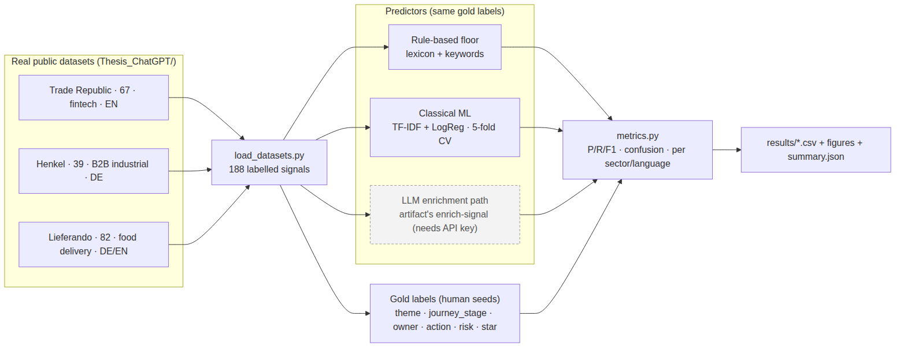
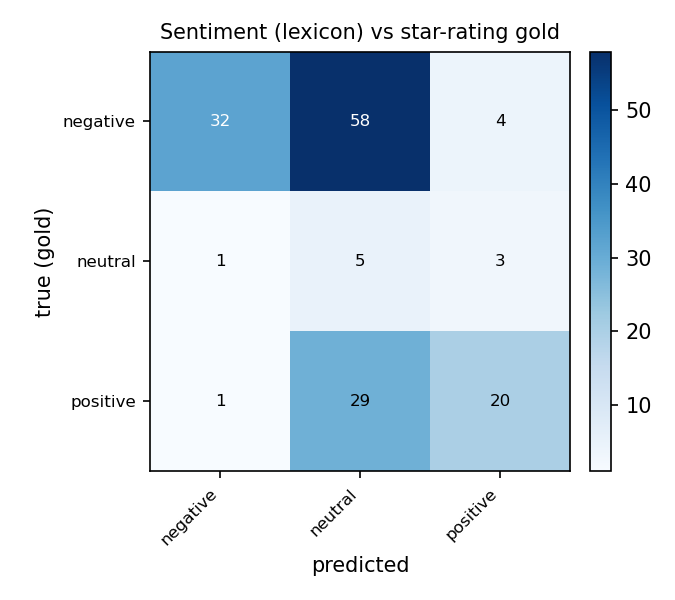
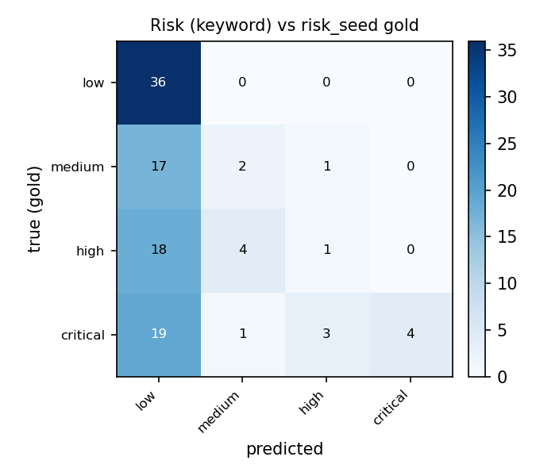
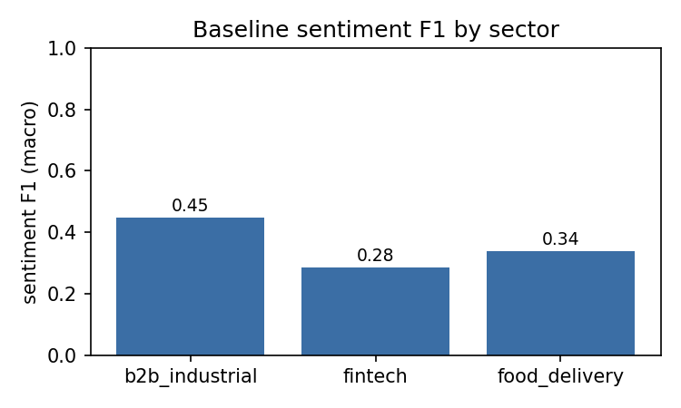

# Chapter 5: Evaluation and Results

This chapter reports the two evaluation streams introduced in Chapter 3. Section 5A presents the **quantitative gold-set evaluation** of the artifact's enrichment and routing pipeline against human-curated labels on real customer feedback (RQ3). Section 5B presents the **qualitative practitioner study** — its protocol, instruments, and analysis plan — with results sections held open for the interview data being collected (RQ4). All §5A numbers are computed by the reproducible harness in `evaluation/` and read from `evaluation/results/`; none are hand-entered.

---

## 5A. Quantitative Gold-Set Evaluation (RQ3)

### 5A.1 The corpus

The evaluation corpus is **188 real, publicly-sourced, paraphrased and de-identified customer signals** drawn from three sectors and labelled independently of the artifact (Chapter 3, §3.7):

| Sector | Dataset | Signals | Dominant language |
|---|---|---:|---|
| Food delivery | Lieferando | 82 | DE / EN |
| Fintech / brokerage | Trade Republic | 67 | EN |
| B2B industrial | Henkel (adhesives) | 39 | DE |
| **Total** | | **188** | EN 102 · DE 84 · other 2 |

Signals originate from Trustpilot (70), the Apple App Store (38), Reddit (33), Amazon (26), Google Play (10), and DIY retailers Hornbach and OBI (11). Human-curated gold labels are present as follows: a **1–5 star rating** for 153 signals (the independent sentiment reference), a closed-set **risk/severity** label for 106 signals (Trade Republic and Henkel), and open-vocabulary **theme** (176 distinct values), **journey stage** (27), and **recommended owner** (51) labels for the full corpus. The high cardinality of the latter three confirms the methodological choice (Chapter 3, §3.5.2) to treat them as open-vocabulary fields evaluated by semantic agreement rather than exact match.

### 5A.2 Method recap

Three predictors are compared on the same gold labels, forming a deliberate progression from no learning to full contextual reasoning:

1. **Rule-based floor** — a bilingual (EN/DE) lexicon sentiment classifier and a keyword severity classifier (the pre-LLM tradition; Taboada et al., 2011). No training, fully transparent.
2. **Classical ML** — TF-IDF character n-grams + Logistic Regression, evaluated by stratified 5-fold cross-validation with out-of-fold predictions (no train/test leakage), class-balanced to handle the skew toward negative feedback.
3. **LLM enrichment path** — the artifact's own enrichment reasoning. Its run against *this* harness's 188-signal seed-label corpus is wired and reproducible (`evaluation/predict_llm.py`) but still pending; however, the artifact now carries its own **committed, live LLM evaluation** — an **80-case bilingual golden set** (60 English, 20 authored German; grown from the initial 60 cases, §5A.7) plus a real-data run over the same three public datasets — whose results are reported as convergent evidence in §5A.7 rather than filled into this table, because the gold standards differ.

Sentiment is scored against the star-rating gold (1–2 → negative, 3 → neutral, 4–5 → positive), a non-circular reference because it is independent of the text the classifier reads.

### 5A.3 Sentiment results

| Predictor | n | Accuracy | Macro-F1 | Weighted-F1 |
|---|---:|---:|---:|---:|
| Rule-based lexicon (floor) | 153 | 0.37 | 0.37 | 0.48 |
| TF-IDF + Logistic Regression (5-fold CV) | 153 | **0.78** | **0.52** | **0.76** |
| LLM enrichment path | 153 | *(pending — see §5A.7)* | *(pending)* | *(pending)* |

The classical-ML baseline improves accuracy by **41 points** and macro-F1 by **15 points** over the lexicon floor. The per-class and confusion analysis explains why the floor is weak: of 94 gold-negative signals the lexicon labels **58 as neutral**, because the *paraphrased, operational* phrasing of real feedback ("Transaction history cannot be exported to CSV") carries few overt sentiment words. Lexicon precision on the negative class is high (0.94) but recall is low (0.34) — when an explicit negative word appears the call is reliable, but most real complaints are stated descriptively. This is a substantive finding, not merely a baseline artefact: **surface-lexicon sentiment is inadequate for operational customer feedback, motivating contextual models.** The neutral class is small (9 of 153) and noisy, depressing macro-F1 for both methods.

### 5A.4 Risk / severity results

Risk is scored on the 106 signals (Trade Republic + Henkel) carrying a closed-set `risk_seed` label {low, medium, high, critical}.

| Predictor | n | Accuracy | Macro-F1 | Weighted-F1 |
|---|---:|---:|---:|---:|
| Keyword severity (floor) | 106 | 0.41 | 0.26 | 0.30 |
| TF-IDF + Logistic Regression (5-fold CV) | 106 | **0.68** | **0.65** | **0.67** |
| LLM enrichment path | 106 | *(pending — see §5A.7)* | *(pending)* | *(pending)* |

The keyword floor collapses almost everything to "low": it correctly tags all 36 low-risk signals but mislabels 18 of 23 high and 19 of 27 critical signals as low, because severity in paraphrased text is rarely signalled by a fixed keyword. Its one strength is precision on "critical" (1.00) — when an unambiguous critical term ("blocked", "fraud") fires, it is right — but recall is only 0.15. Collapsed to a binary **escalate (high+critical) vs routine** decision, the floor reaches 0.59 accuracy and 0.50 macro-F1, still weak. The classical-ML model recovers most of the lost signal (macro-F1 0.26 → **0.65**), learning sector-specific severity cues from character n-grams across both languages.

### 5A.5 Generalisation across sectors and languages

Lexicon sentiment macro-F1 varies by slice — B2B industrial 0.45, food delivery 0.34, fintech 0.28; German 0.42, English 0.27 — confirming that a fixed lexicon transfers poorly and unevenly across domains and languages (relevant to H3 and to the fairness concern that some languages are triaged less reliably; Mehrabi et al., 2021). The classical-ML model, trained across the pooled multilingual corpus with character n-grams, is more uniform. The per-slice tables are written to `evaluation/results/sentiment_by_sector.csv` and `sentiment_by_language.csv`.

 *(The LLM path's per-slice behaviour will be reported once run; the hypothesis, grounded in the multilingual NLP literature of Chapter 2, is that it narrows the cross-language gap further.)*

### 5A.6 Interpretation and threats

The results support a clear, defensible claim for RQ3: **the accuracy of the loop's automated triage is strongly method-dependent, and a learned model is necessary** — naive lexical methods fail on real, paraphrased, multilingual feedback, while even a lightweight learned model reaches usable accuracy (sentiment 0.78, risk 0.68), with the contextual LLM path positioned to improve further.

What §5A tests, and what it does not, should be stated plainly. It evaluates a **precondition** of the contribution — that the enrichment feeding the loop is good enough to act on — not the contribution itself. The thesis's distinctive claims (DP1 measured closure; DP2 perishable learning memory; §1.2) are evaluated by *design demonstration* (Chapter 4) and *practitioner perception* (§5B), not by these numbers; that an outcome contract or a decaying memory improves real decisions is argued and demonstrated, not yet measured. The honest reading of §5A is therefore narrow but firm: the triage layer the loop depends on clears the bar a learned model can reach, and would otherwise fail. The threats of Chapter 3, §3.5.4 further bound these claims: the gold labels are defensible human judgements rather than an oracle; the corpus is modest (188 signals) and balanced rather than population-representative; and the open-vocabulary theme/journey/owner fields are evaluated semantically and reported with caution. The headline numbers therefore characterise the pipeline *on this corpus* and are not population estimates.

### 5A.7 Convergent evidence from the artifact's in-repo evaluation

This section reports results produced by the artifact's own evaluation infrastructure, committed in its repository (`apps/api/app/evals/`: a curated golden set — initially 60 cases, since grown to an **80-case bilingual set** — a live runner with within-run A/B testing, a real-data evaluator, and a results ledger, `history.jsonl`). They are reported here as **convergent evidence**, not as entries in the §5A.3–5A.4 tables, because the gold standards differ: the in-repo golden set is curated, whereas this chapter's harness scores 188 externally seed-labelled signals. The numbers below are read from the committed ledger — the run of 3 July 2026 and the two runs of 17 July 2026, all on model GLM-5.2 at temperature 0 — and the corresponding supervisor report; none are re-computed here.

**Golden-set results, 3 July 2026 (n = 60; dated history).** On the original 60-case set the live LLM path achieved **96.7% sentiment accuracy**, **81.7% urgency accuracy**, and **80.8% theme matching by meaning** (45.8% by exact string — the gap between the two quantifying how much theme agreement is semantic rather than lexical, and directly supporting this chapter's decision to score open-vocabulary fields semantically). The reported hallucination rate was **6.7%** in that run (0% in several earlier runs), with zero PII leaks across the ledger.

**Growth to an 80-case bilingual set (July 2026).** Because the corpus behind the golden set turned out to contain no natural German texts (the three public datasets' texts are English paraphrases), the set was extended with **20 authored German items** (ids `eval-061`–`080`), written to cover registers the English items do not — formal *Sie*, informal *du*, irony, and compound nouns — and labelled under the same documented labelling rules. The new items were then **adversarially verified by two independent skeptic agents**: 19 of 20 labels were confirmed, and exactly one dispute was accepted (`eval-078`, urgency low → medium). The German stratum is split 14 optimisation / 6 held-out, and every item in the set now carries a language field (60 en / 20 de). The honest disclosure, carried in the artifact's model card and repeated here: **the German stratum is authored, not naturally occurring** — a deliberate, documented compromise, since no natural German customer texts were locally available.

**Baseline run, 17 July 2026, 07:24 UTC (n = 80).** With the production configuration (few-shot exemplars on) and bootstrap 95% confidence intervals: sentiment **97.50%** (CI 94–100%), urgency **85.00%** (CI 76–92%), tag F1 (fuzzy) **74.24%**, hallucination **1.25%**, PII leaks **0**. Per language: EN (n = 60) sentiment 98.33%, urgency 86.67%, exact-tag-set 23.33%; DE (n = 20) sentiment 95.00%, urgency 80.00%, exact-tag-set **0%**. The in-run paired A/B (exemplars off vs on, identical items, McNemar) showed exact-tag-set 7.5% → 17.5% (p = 0.039, significant) and urgency 82.5% → 85.0% (p = 0.727, not significant).

**One eval-improve iteration: gap → root cause → intervention.** The baseline exposed a clear German gap — most visibly the 0% German exact-tag-set score. The diagnosis: the few-shot exemplar set was **English-only** (7 exemplars), so the urgency rubric (unrecoverable loss happening *now* = critical) and the `positive_trend` praise-tag convention never transferred to German. The intervention: **two fresh German exemplars** — one unrecoverable-payment-loss critical case, one praise case carrying `positive_trend` + `good_support` — deliberately *not* drawn from golden-set texts, so no train/test leakage is introduced.

**Post-intervention run, 17 July 2026, 15:22 UTC (n = 80; the published snapshot).** Sentiment **97.50%** (CI 94–100%), urgency **86.25%** (CI 79–94%), tag F1 (fuzzy) **80.17%**, hallucination **2.50%** (one additional English item; within noise; disclosed), PII **0**. Per language: EN 98.33% / 86.67% / 33.33%; DE 95.00% / 85.00% / 15.00% (sentiment / urgency / exact-tag-set). The **in-run paired A/B is the designed inference**: exact-tag-set off 8.75% → on 28.75%, McNemar **p = 0.001** (significant; 19 items gained, 3 lost); urgency off 81.25% → on 86.25%, p = 0.219 — directionally positive but **underpowered at n = 80**, so no urgency gain is claimed; sentiment unchanged (p = 1.0). The DE/EN urgency gap narrowed from 6.7 pp to 1.7 pp, with English metrics unregressed. Cross-run comparisons (3 July vs 17 July, baseline vs post-intervention) carry a **model-noise caveat** — GLM-5.2 is non-deterministic even at temperature 0 — which is precisely why the significance test is paired *within* a single run.

**Scope limits of the harness itself.** The hallucination heuristic is **English-scope only by construction**: it token-grounds predicted tags against the English tag vocabulary, which falsely flags correct tags on German text; non-English items are therefore excluded from that metric rather than reported as a meaningless number. This, like the authored-German provenance, is disclosed in the artifact's model card.

**Published metrics as a mechanism.** An explicit `--publish` flag writes a committed snapshot (`published_metrics.json`: n, per-language accuracies with denominators, confidence intervals, dataset date, and provenance notes) that is served by the API (`GET /model-card/metrics`) and rendered in the product's model card — so the numbers users see are the committed evaluation outputs, not marketing copy, and every published figure is traceable to a dated run.

**Cross-industry real-data run.** Run over the *same three public datasets* as this chapter (Trade Republic, Henkel, Lieferando), the pipeline reaches **≈90% sentiment accuracy against the star rating as proxy ground truth** — the same non-circular reference §5A.3 uses — and assigned urgency rises consistently as star ratings fall in all three sectors. Industry-appropriate vocabularies emerge with no fine-tuning or per-sector configuration, the empirical basis for the per-industry-profiles design decision (§4.3.5).

**Learning-loop influence, measured.** Feeding stored learnings back into synthesis raised the share of a past learning's remedy appearing in the new recommendation from **21% to 71%** (66.7% adoption; alignment lift 0.503 against a same-run noise floor that absorbs model jitter) — direct evidence that the perishable-memory mechanism (DP2) steers recommendations rather than decorating them.

**Honest boundaries, as committed in the repository's own evaluation notes.** (i) At 60 cases the few-shot exemplar lift was **not statistically significant** (within-run McNemar, p ≈ 1.0 on sentiment, urgency, and exact-tag) — an underpowered sample, not a demonstrated gain; after the extension to 80 bilingual cases and the German-exemplar intervention, the exact-tag-set lift **is** significant (p = 0.001), while the urgency lift remains underpowered (p = 0.219) and is not claimed. (ii) The evaluation confronted **model non-determinism**: GLM-5.2 produces slightly different outputs across identical runs even at temperature 0, which is why the harness compares conditions *within* a single run and tests significance rather than comparing across runs. (iii) The German gold stratum is **authored rather than naturally occurring**, and the hallucination metric is **English-scope only** (see above) — both disclosed in the model card. (iv) Most importantly, the **outcome data behind the learning loop is still simulated**: adoption shows the loop steers recommendations, but whether the steered remedy is *better* requires a live outcome contract on real data — the single most important open step (§6.5). Taken together with §5A.3–5A.6, the two evidence streams converge on the same conclusion from different gold standards: contextual LLM triage clears the accuracy bar the loop requires, while the loop's *outcome* claim remains to be earned on real data.

### 5A.8 An external-review episode as a naturalistic ex-post evaluation input

A third, unplanned evaluation input arose during the write-up window (16–19 July 2026): **two independent LLM-based strategic reviews** of the deployed artifact were obtained — one product/market-focused, yielding 17 concrete findings; one strategy-focused, scoring the artifact on dimensions and rating, i.a., "scientific validity" 2/10 and "security" 3/10. It is reported here modestly, as an additional *naturalistic, ex-post* evaluation input to a further design cycle (in the sense of the evaluation-method taxonomy of Prat et al., 2015, and the iterative design cycles of Hevner, 2007) — not as a validated review method, and with no claim of methodological novelty: the reviewers are LLMs, the episode is singular, and it was not part of the registered evaluation plan.

The response followed the same verify-before-believe discipline as the rest of the chapter. **45 of the reviews' factual claims were adversarially verified** against the codebase and the live deployment by nine independent read-only verification agents: approximately **27 confirmed, 13 partially correct, 2 refuted, and 1 unverifiable**. The surviving findings were ranked into a 38-item response plan; **20 pull requests** (17–19 July) implemented every code-reachable item; and a read-only post-deploy verification script of **17 live checks** confirmed all fixes serving in production (**17/17**, 19 July). Two recommendations were rejected with documented reasons (building survey capture; configurable autonomy levels).

Two observations bound the weight this episode can carry. First, the reviews were **substantially right about the trust and credibility layer** — the critique that motivated much of the measurement-rigor and governance hardening reported elsewhere in this thesis. Second, they were **materially wrong about several "missing" capabilities that in fact existed** — alerting/digests, the MCP server, seeded policy templates, drafted legal documents, and interrupted-time-series estimates with confidence intervals — because the reviewers could only see the *deployed surface*, not the repository behind it. The refuted claims are therefore themselves a finding: an external evaluation of an artifact is an evaluation of what the artifact *shows*, and capabilities that are built but not surfaced are, for evaluative purposes, absent. That asymmetry — genuine gaps confirmed, invisible strengths misjudged — is precisely what makes such a review useful as naturalistic input and unreliable as a verdict.

---

## 5B. Qualitative Practitioner Study (RQ4)

### 5B.0 Two evidence sources: in-depth interviews and a breadth survey

RQ4 is addressed by two complementary instruments. The **in-depth interviews and task sessions** (12–15 participants; §5B.2) are the *primary* evidence — they carry the prototype-reaction and task-metric findings that only observation can provide. A short, anonymous **supplementary survey** (instrument in Appendix A; distributed via practitioner communities on Reddit and LinkedIn) adds *breadth*, confirming the current-practice and attitude hypotheses (H1, H2, H4, H5, H6, H7, H8) across a larger, shallower sample. The survey is deliberately minimal — a single Likert matrix in which each row is a hypothesis, plus a source-count and a closure-frequency item — and is analysed by a reproducible script (`evaluation/survey_analysis.py`) that reports top-2-box agreement and a confirmed / refine / not-supported verdict per hypothesis. The survey's limits are explicit and bound its weight: it is self-report and attitudinal, its sample is a convenience sample skewed to those platforms, and H6/H7 are measured there as *hypothetical* comfort rather than observed trust — so on those two the interviews remain the stronger test. Survey verdicts are reported below alongside the interview themes and folded into the hypothesis table (§5B.5) and the traceability matrix (Appendix D).

> **‹PLACEHOLDER: survey results — n, response source split (Reddit/LinkedIn), and the per-hypothesis verdict table from `evaluation/results/survey_verdicts.csv`.›**

### 5B.1 Status

The qualitative study is the *primary* evidence for the design's validity with practitioners (Chapter 3, §3.3). Data collection runs over the evaluation window; this section documents the executed protocol and holds the results open. **No interview findings are reported until the data are collected; nothing here is simulated.**

### 5B.2 Protocol (as executed)

Twelve to fifteen practitioners (marketing / product / CX, 2+ years, companies of ~10–500 staff that actively collect feedback) are recruited purposively with role and company-size variation (recruitment materials, Appendix A). Each ~25–30 minute online session has two parts: a semi-structured discussion of current practice (eliciting H1, H2, H5, H8) and a task-based prototype encounter (triage, govern a rule, approve a queued action, inspect a closed-loop measurement), with think-aloud. Sessions are recorded with consent and transcribed; task success and time-to-action are captured by the facilitator and the platform's `events` telemetry. Participants then complete the SUS and the TAM + trust battery (Appendix A). The full interview and task guide is in Appendix A.

### 5B.3 Analysis plan

Transcripts are analysed by reflexive thematic analysis (Braun & Clarke, 2006) against the codebook in Appendix A, with a double-coded subset and an inter-rater reliability check. SUS is scored 0–100; TAM/trust subscales are summarised descriptively. Findings are mapped to H1–H8.

### 5B.4 Results

*This section is a fill-in scaffold: every table cell and quote-slot below is populated from the interview data once collection is complete. Nothing here is simulated. Cells marked "—" await data; quote-slots are tagged with the codebook code (Appendix A) they evidence.*

#### 5B.4.1 Participants

Target N = 12–15; reported anonymised. (`role` ∈ marketing / product / CX; `size` = approx. headcount band.)

| ID | Role | Sector | Company size | Tenure (yrs) | Session mode |
|----|------|--------|--------------|--------------|--------------|
| P01 | — | — | — | — | interview + tasks |
| P02 | — | — | — | — | — |
| … | … | … | … | … | … |
| P15 | — | — | — | — | — |
| **Summary** | ‹role mix› | ‹sector mix› | ‹size range› | ‹median› | — |

#### 5B.4.2 Current-practice gaps (H1, H2, H5, H8)

For each theme: report **prevalence** ("‹k› of ‹N› participants") and one or two anonymised quotes. Themes follow the codebook's `gap.*` codes.

**Theme — the insight-action gap (`gap.insight_action`, H1).** Prevalence: ‹k/N›.
> ‹P—, role›: "…"

**Theme — signal fragmentation (`gap.fragmentation`, H2).** Prevalence: ‹k/N›.
> ‹P—, role›: "…"

**Theme — unclear ownership (`gap.ownership`, H5).** Prevalence: ‹k/N›.
> ‹P—, role›: "…"

**Theme — no measured closure (`gap.no_closure`, H8).** Prevalence: ‹k/N›.
> ‹P—, role›: "…"

**Theme — lost memory of what worked (`gap.memory_loss`, H1/H8).** Prevalence: ‹k/N›.
> ‹P—, role›: "…"

#### 5B.4.3 Prototype reaction — usefulness, usability, trust (H4, H5, H6, H7; RQ4)

**Prioritisation valued (`value.prioritisation`, H4).** Prevalence: ‹k/N›.
> ‹P—, role›: "…"

**Owner routing — valued or distrusted (`value.routing`, H5).** Prevalence: ‹k/N›.
> ‹P—, role›: "…"

**Human approval and comfort with automation (`trust.oversight`, H6).** Prevalence: ‹k/N›.
> ‹P—, role›: "…"

**Auditability and accountability (`trust.audit`, H7).** Prevalence: ‹k/N›.
> ‹P—, role›: "…"

**Wanting to see *why* (`trust.transparency`, H7).** Prevalence: ‹k/N›.
> ‹P—, role›: "…"

**Adoption barriers (`barrier.adoption`, RQ4).** Prevalence: ‹k/N›.
> ‹P—, role›: "…"

**Usability friction (`usability.friction`, RQ4).** Prevalence: ‹k/N›.
> ‹P—, role›: "…"

*‹Add any inductive themes that emerge during coding here, with code, prevalence, and quotes.›*

#### 5B.4.4 Usability and acceptance metrics

**System Usability Scale (0–100).** ‹Insert per-participant scores; report mean, SD, and adjective rating (≈68 = average; >80 = good).›

| Statistic | Value |
|---|---|
| N | — |
| Mean SUS | — |
| SD | — |
| Min / Max | — / — |
| Adjective rating | — |

**Technology Acceptance + Trust (1–7).** ‹Means and SDs per subscale.›

| Subscale | Mean | SD | Items |
|---|---|---|---|
| Perceived Usefulness (PU) | — | — | 1–4 |
| Perceived Ease of Use (PEOU) | — | — | 5–8 |
| Trust / Oversight / Auditability | — | — | 9–12 |

#### 5B.4.5 Task metrics (T1–T4)

From facilitator records and the platform `events` telemetry. Time-to-action reported descriptively (median, range); no significance claim (Chapter 3, §3.10).

| Task | Description | Completion (k/N) | Time-to-action (median; range) |
|------|-------------|------------------|--------------------------------|
| T1 | Triage to most urgent problem | — | — |
| T2 | Create a governed rule (auto vs approval) | — | — |
| T3 | Approve a queued action | — | — |
| T4 | Inspect closure + learning | — | — |

#### 5B.4.6 Inter-rater reliability

‹Report the agreement statistic (e.g., Cohen's κ) on the double-coded subset, the proportion of transcripts double-coded, and how disagreements were reconciled.›

### 5B.5 Hypothesis outcomes

The table below is completed once analysis is done; each hypothesis is marked **confirmed / refined / rejected** with its evidence.

| Hypothesis | Outcome | Evidence |
|---|---|---|
| H1 insight-action gap | ‹pending› | interviews |
| H2 signal fragmentation | ‹pending› | interviews |
| H3 signal-type classifiability | partly addressed by §5A | gold set |
| H4 journey-stage prioritisation | ‹pending› | interviews; gold set |
| H5 owner routing failure | ‹pending› | interviews; gold set |
| H6 ownership/approval → trust | ‹pending› | task sessions; TAM |
| H7 auditability → trust | ‹pending› | task sessions; TAM |
| H8 closure rarely practised, valued when offered | ‹pending› | interviews |
